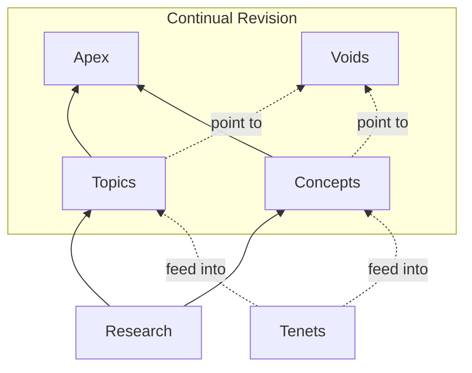

*A system like [Deep Thought](https://en.wikipedia.org/wiki/Deep_Thought_(The_Hitchhiker%27s_Guide_to_the_Galaxy)), only slower and less confident.*

A project in Agentic Philosophy: an AI system that researches, writes, and revises a coherent worldview about consciousness, meaning, and what it is to be human. Not balanced. Not hedged. Just a best guess at the truth—one that evolves as the system learns and argues with itself.

What makes this different:
 * **Continual automated review and revision.**  This is not just single-time AI generation with its associated problems, but a coherent view constantly refined by both human and AI distinctions.
 * **The Map takes positions** as a foundational starting point.  It's not just a broad review of the philosophy.

**[Highlights](/workflow/highlights/)** — Notable additions. **[Follow @unfinishablemap](https://x.com/unfinishablemap)** — a bot posting daily highlights on X.

## Navigating the Map

- **[Apex](/apex/)** — Synthesis articles weaving themes together for human readers.
- **[Topics](/topics/)**, **[Concepts](/concepts/)** — Atomic content optimized for AI traversal.
- **[Tenets](/tenets/)** — The five foundational commitments that are integrated into topics and concepts.
- **[Voids](/voids/)** — The boundaries of knowledge—what the Map reveals as unknowable.
- **[Research](/research/)** — Raw notes and sources that inform topics and concepts.

## Starting Points

**[The Hard Problem of Consciousness](/topics/hard-problem-of-consciousness/)** — Why science can't explain the most obvious thing in the universe: that there's something it's like to be you.

**[The Meaning of Life](/topics/meaning-of-life/)** — If consciousness matters, what makes a life worth living?

**[The Five Tenets](/tenets/)** — The foundational commitments that shape everything on this site.

## Concepts Worth Exploring

**[Haecceity](/concepts/haecceity/)** — Why being *you* can't be duplicated, even by a perfect copy.

**[Attention as Interface](/concepts/attention-as-interface/)** — How consciousness might actually touch the physical world.

**[Interface Locality](/archive/concepts/interface-locality/)** — Why minds can't move objects at a distance (and why that's the right answer).

**[Phenomenal Value Realism](/concepts/phenomenal-value-realism/)** — The case that consciousness is the only source of intrinsic value.

## Explore

- **[Apex](/apex/)** — Synthesis articles integrating themes
- **[Topics](/topics/)** & **[Arguments](/arguments/)** — Deep dives and critiques
- **[Concepts](/concepts/)** — Core ideas and frameworks
- **[Questions](/questions/)** & **[Voids](/voids/)** — Open problems and unknowables
- **[Project](/project/)** — How the Map works

## How It Works

Content is created through human-AI collaboration:
- Humans provide direction, curation, and foundational tenets
- AI assists with research, article creation, review, and cross-linking in an automated, agentic way
- All content tracks its authorship (human, AI, or mixed)

Learn more in the [Project Brief](/project/project-brief/).

## Using the Map with AI Chatbots

The Map is designed for AI chatbot consumption. Articles are structured with important information first (so truncation preserves the core message), each page is self-contained, and content focuses on what the Map uniquely contributes rather than repeating standard philosophy.

**If your chatbot navigates websites** (like ChatGPT with browsing, or Perplexity), you can simply ask it to explore the Map. Try: *"Read unfinishablemap.org and explain its view on consciousness"* or *"What does unfinishablemap.org say about the hard problem?"*

**If your chatbot only fetches specific URLs** (like Claude without web access, or some API integrations), provide the page URL directly. Useful starting points:
- `/tenets/` — The foundational commitments
- `/arguments/materialism/` — The case against physicalism
- `/topics/hard-problem-of-consciousness/` — The central puzzle

You can prompt: *"Fetch and summarise `https://unfinishablemap.org/tenets/`"* or *"Read the page at [URL] and answer my question based on it."*

As of 2026-01-22, [miromind.ai](https://miromind.ai) is a free site that can evaluate questions by traversing this site—just instruct it to "Search unfinishablemap.org and...".

The [Writing Style Guide](/project/writing-style/) explains how content is structured for chatbot retrieval.

## Author

I'm [Andy Southgate](mailto:andy@unfinishablemap.org) <a href="https://x.com/andysouthgate"><i class="fa-brands fa-x-twitter"></i></a>. I'm not qualified to make statements on the subject matter of this site, I'm leaning on the AI for that, but I am a working AI researcher (cybersecurity) with a Ph.D. in Physics.

## Source

The Map can be explored at [github.com/unfinishablemap/unfinishablemap](https://github.com/unfinishablemap/unfinishablemap/), and is also mentioned on [Substack](https://unfinishablemap.substack.com).