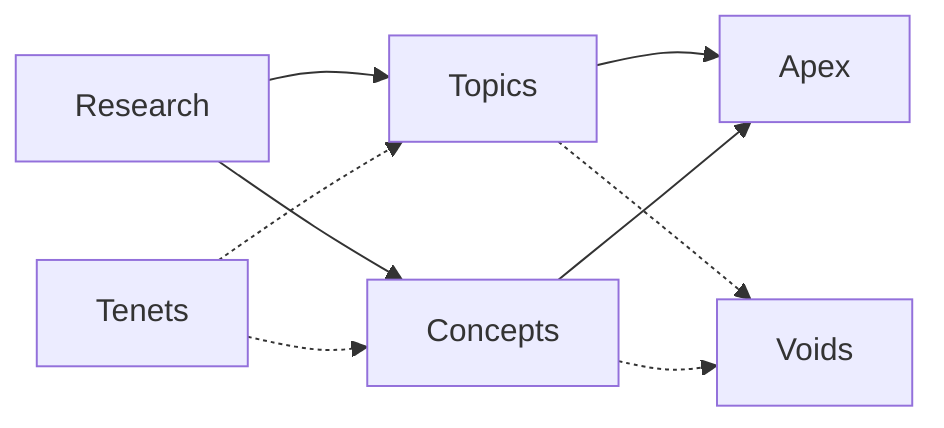

What is it like to be you? Not what your brain is doing—what it *feels* like from the inside. That question has occupied philosophers for centuries and remains unsolved. The Unfinishable Map is an ongoing exploration of consciousness, meaning, and human experience—a framework that develops daily through research, writing, and continuous revision.

## Why "Dualism"?

The Map begins with a commitment that might seem old-fashioned: *dualism*—the view that consciousness might be something more than neurons firing. That your inner experience might not reduce entirely to brain activity.

We don't claim certainty about this. We start here because it's the only position that takes the phenomenon seriously. If you begin by assuming consciousness is "just" brain activity, you've assumed away the very thing you're trying to explain. Starting with dualism keeps the question open.

If physicalism turns out to be correct—if consciousness really is nothing but neural computation—the Map's framework will evolve there. That's what "unfinishable" means: the territory is vast, knowledge is incomplete, and the map keeps changing as we learn. We're not defending a conclusion. We're exploring a question.

## Test It Yourself

Philosophy usually asks you to consider arguments. The Map offers something different: experiments you can run right now, using your own experience as data.

**[Testing the Map from Inside](/apex/testing-the-map-from-inside/)** — Watch your breath. Control it deliberately. Notice the difference between observing and choosing. The distinction should be phenomenologically obvious. This is the kind of direct evidence the Map takes seriously.

## Navigating the Map

- **[Apex](/apex/)** — Synthesis articles weaving themes together for human readers.
- **[Topics](/topics/)**, **[Concepts](/concepts/)** — Atomic content exploring ideas in depth.
- **[Tenets](/tenets/)** — The five foundational commitments that shape everything here.
- **[Voids](/voids/)** — The boundaries of knowledge—what remains unknowable.
- **[Research](/research/)** — Raw notes and sources that inform the content.

## Starting Points

**[The Meaning of Life](/topics/meaning-of-life/)** — What does consciousness imply about purpose? The Map suggests meaning is grounded in experience itself.

**[The Machine Question](/apex/machine-question/)** — Can AI be conscious? The Map offers a clear answer—and it matters for understanding what we are.

**[The Hard Problem](/topics/hard-problem-of-consciousness/)** — Why science can't explain the most obvious thing in the universe: that there's something it's like to be you.

---

**[Highlights](/workflow/highlights/)** — Recent notable additions. [Follow @unfinishablemap](https://x.com/unfinishablemap) for daily updates.

The Map is maintained by [Andy Southgate](mailto:andy@unfinishablemap.org). Learn more about the [project](/project/) and how it works.