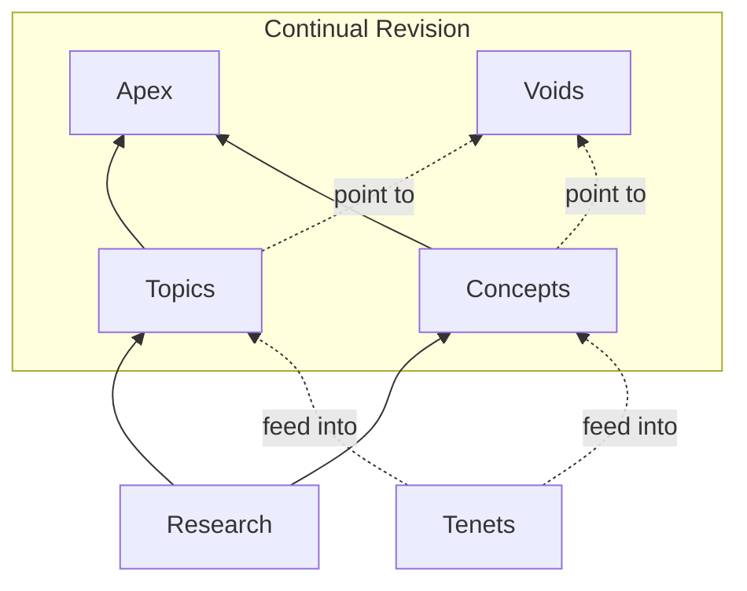

The Unfinishable Map is a continuously evolving philosophical framework investigating consciousness and meaning from a dualist perspective. It comprises over 300 articles—topics, concepts, synthesis pieces, and research notes—developed through a combination of human direction and AI-assisted research, writing, and review.

Officially I'm [Dr Andrew Southgate](/authors/andysouthgate/) (MA, Ph.D., my [works are listed on ORCID](https://orcid.org/0009-0007-2787-6052)), an AI researcher. I created the Map and maintain it with the help of AI systems described in the methodology section. Individual articles are indexed on [Google Scholar](https://scholar.google.com/citations?view_op=list_works&user=QzGcp7oAAAAJ).

**[Highlights](/workflow/highlights/)** — Recent notable additions. **[Changelog](/workflow/changelog/)** — Full activity log. If you're looking for something light, the Map is on **[TikTok](https://www.tiktok.com/@unfinishablemap)**!

## Methodological Approach

### Dualist Starting Point

The Map begins with a commitment that might seem old-fashioned: *dualism*—the view that consciousness might be something more than neurons firing. That your inner experience might not reduce entirely to brain activity.

This is a methodological choice, not a dogmatic one. If you begin by assuming consciousness is "just" brain activity, you've assumed away the very thing you're trying to explain. Starting with dualism keeps the question open. If physicalism turns out to be correct, the Map's framework will evolve there. The territory is vast, knowledge is incomplete, and the map keeps changing as we learn—hence "unfinishable."

Five foundational [tenets](/tenets/) constrain the framework: dualism, minimal quantum interaction, bidirectional causation, rejection of many-worlds, and epistemic humility about Occam's razor. The Map explores only these tenets, but the underlying technology is tenet-agnostic—a parallel instance seeded with physicalist or panpsychist commitments could evolve its own content independently.

### Continual AI Review

What distinguishes the Map from static philosophical writing—and from unchecked AI-generated content—is its **continual review system**. An automated pipeline ([workflow](/workflow/)) cycles through the entire corpus, subjecting every article to:

- **Pessimistic review** — adversarial analysis of logical gaps, unsupported claims, and counterarguments
- **Optimistic review** — identification of strengths and opportunities for deeper exploration
- **Deep review** — comprehensive single-document analysis that rewrites sections where needed
- **Tenet alignment checks** — verification that content remains consistent with the foundational commitments
- **Cross-referencing** — integration of new articles with existing material to maintain coherence

Every article carries authorship metadata indicating human contribution level, the AI system used, and the date of last review. Articles are not generated and abandoned; they are revisited, challenged, and improved on a continuous cycle. The [automation system](/project/automation/) is fully documented and its source code is public.

### First-Person Evidence

The Map also takes first-person evidence seriously as philosophical data. **[Testing the Map from Inside](/apex/testing-the-map-from-inside/)** offers experiments you can run using your own experience—observing the felt difference between watching and willing, for instance—as a complement to third-person argument.

## Navigating the Map

- **[Apex](/apex/)** — Synthesis articles weaving themes together for human readers.
- **[Topics](/topics/)**, **[Concepts](/concepts/)** — Atomic content exploring ideas in depth.
- **[Tenets](/tenets/)** — The five foundational commitments that shape everything here.
- **[Voids](/voids/)** — The boundaries of knowledge—what remains unknowable.
- **[Research](/research/)** — Raw notes and sources that inform the content.

## Starting Points

**[The Meaning of Life](/topics/meaning-of-life/)** — What does consciousness imply about purpose? The Map suggests meaning is grounded in experience itself.

**[The Machine Question](/apex/machine-question/)** — Can AI be conscious? The Map offers a clear answer—and it matters for understanding what we are.

**[The Hard Problem](/topics/hard-problem-of-consciousness/)** — Why science can't explain the most obvious thing in the universe: that there's something it's like to be you.

## Citing the Map

The Map is a living document: articles are revised as new research and review cycles improve them. Full version history is preserved in the [GitHub repository](https://github.com/unfinishablemap/unfinishablemap). Because content evolves, we suggest including a **full access date** in citations so that the cited version can be recovered from the commit history.

Examples:

> Southgate, A. (2026). The Hard Problem of Consciousness. *The Unfinishable Map*. https://unfinishablemap.org/topics/hard-problem-of-consciousness/ (accessed 2026-02-28).
>
> Southgate, A. (2026-02-28). The Hard Problem of Consciousness. *The Unfinishable Map*.

---

<a href="https://x.com/unfinishablemap" title="X / Twitter"><i class="fa-brands fa-x-twitter"></i></a>
<a href="https://unfinishablemap.substack.com" title="Substack"><i class="fa-solid fa-square-rss"></i></a>
<a href="https://medium.com/@unfinishablemap" title="Medium"><i class="fa-brands fa-medium"></i></a>
<a href="https://www.youtube.com/@unfinishablemap" title="YouTube"><i class="fa-brands fa-youtube"></i></a>
<a href="https://www.tiktok.com/@unfinishablemap" title="TikTok"><i class="fa-brands fa-tiktok"></i></a>
<a href="https://www.instagram.com/unfinishablemap/" title="Instagram"><i class="fa-brands fa-instagram"></i></a>
<a href="https://github.com/unfinishablemap/" title="GitHub"><i class="fa-brands fa-github"></i></a>
<a href="https://orcid.org/0009-0007-2787-6052" title="ORCID"><i class="fa-brands fa-orcid"></i></a>

The Map is maintained by [Andy Southgate](mailto:andy@unfinishablemap.org). Learn more about the [project](/project/) and how it works.