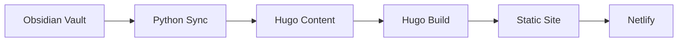

The Unfinishable Map is a philosophical content platform exploring the nature and meaning of life. The project combines human insight with AI-assisted research to build a coherent worldview expressed through structured content.

## Architecture

The data flows through these components:
- **Obsidian vault** - Primary content source (Markdown files with frontmatter)
- **Python sync tools** - Converts Obsidian wikilinks to Hugo markdown links
- **Hugo** - Static site generator that builds HTML from content
- **Netlify** - Hosts the static site

## Project Structure

| Directory | Purpose |
|-----------|---------|
| `obsidian/` | Primary content source (Obsidian vault) |
| `hugo/` | Static site generator and templates |
| `tools/` | Python library modules for sync, LLM, generation |
| `scripts/` | CLI entry points |

## Related Documents

- [project-brief](/project/project-brief/) - Project aims, methods, and design decisions
- [tenets](/tenets/) - Human-curated foundational statements

## Contributing

Content contributions follow the authorship tracking system documented in the project brief. Human edits and AI edits are tracked separately through frontmatter timestamps.