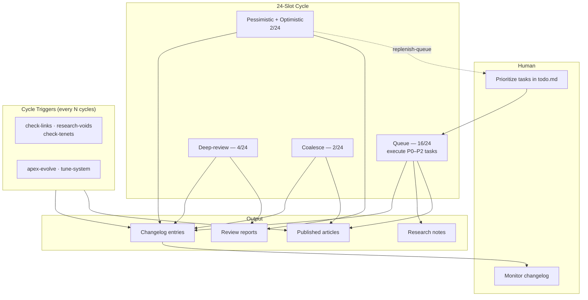

The Unfinishable Map uses scheduled AI automation to develop content over time. The orchestrator runs a deterministic 24-slot cycle that interleaves queue-task execution, deep-reviews, pessimistic and optimistic reviews, and coalesce surveys, alongside five cycle-trigger cadences for cross-section integrity (links, tenets, research, apex synthesis, system tuning). The design [closes loops](/project/closed-loop-opportunity-execution/) from review-recommendation to executed-and-reviewed content within bounded windows — typically under six hours — while maintaining human oversight and alignment with the Map's [tenets](/tenets/).

## How It Works



**Key principle:** AI-generated content is published directly. All activity is logged to the changelog for transparency. Recommendations from optimistic and pessimistic reviews flow back into the queue via `replenish-queue`, closing the loop within the same cycle window.

## Skills and Workflow

For the complete list of available skills (slash commands) and how they work together, see [Workflow System](/workflow/).

The main orchestrator is `scripts/evolve_loop.py`, which runs a deterministic 24-slot task cycle. It intelligently selects and executes tasks based on the cycle position, with time-triggered events like daily highlights at 8am UTC.

## Multi-Perspective Reviews

The review skills use philosophical personas to generate diverse critiques:

### Pessimistic Review Critics

| Persona | Worldview | Attack Vector |
|---------|-----------|---------------|
| Patricia Churchland | Eliminative Materialism | Consciousness talk is folk psychology |
| Daniel Dennett | Hard Physicalism | You're inflating intuitions into metaphysics |
| Max Tegmark | Quantum Skepticism | Decoherence kills quantum mind theories |
| David Deutsch | Many-Worlds Defense | Intuition shouldn't override mathematical elegance |
| Karl Popper | Empiricism | What experiment could prove you wrong? |
| Nagarjuna | Buddhist Philosophy | You're clinging to an illusory self |

### Optimistic Review Supporters

| Persona | Worldview | Praise Focus |
|---------|-----------|--------------|
| David Chalmers | Property Dualism | Taking the hard problem seriously |
| Henry Stapp | Quantum Mind | Engaging physics-consciousness interface |
| Thomas Nagel | Phenomenology | Centering first-person experience |
| Alfred N. Whitehead | Process Philosophy | Avoiding crude substance dualism |
| Robert Kane | Libertarian Free Will | Taking agency seriously |
| Colin McGinn | Mysterianism | Epistemic humility |

### External Outer Reviews

The pessimistic and optimistic personas are simulated by the same Claude family that generates content. The Map's [coherence-inflation countermeasures](/project/coherence-inflation-countermeasures/) require a third lens that does not share the generator's training: outer reviews from external AI systems. These run automatically every night within a dedicated Chrome window (00:00–07:00 UTC):

| Service | Model | Cadence | Mechanism |
|---|---|---|---|
| ChatGPT | 5.5 Pro Extended | Daily 02:00 UTC | Project workspace; site + changelog prompt; Pro thinking |
| Claude | Opus 4.7 Adaptive | Daily 03:00 UTC | Adaptive thinking + Research + Web Search; produces an artefact document |
| Gemini | 2.5 Pro | Daily 04:00 UTC | Deep Research; research plan + Start research click |

Each commission/collect pair drives Chrome via the `mcp__claude-in-chrome__*` tools under a dedicated profile at `~/unfin/chrome-profiles/unfinishable`. A cross-repo `fcntl` lock prevents this pipeline from contending with the sibling `auto_unfin` video pipeline. The generic `/outer-review` post-processor verifies every cited claim against external sources before generating tasks, sends a ~100-word Telegram summary, and commits. Convergent findings across services are a strong signal — the 2026-05-03 (ChatGPT) and 2026-05-04 (ChatGPT, Claude) reviews independently surfaced the same structural critique of tenet-protected reasoning.

## Task Queue

Tasks are managed in [todo](/workflow/todo/):

- **P0**: Urgent — picked first at the next queue slot
- **P1**: High — picked when no P0 is available
- **P2**: Medium — picked when no P0/P1 is available
- **P3**: Low — nice to have, needs human approval

At each queue slot (16 of every 24 cycle slots), the loop picks the highest-priority non-blocked task and executes it. When the executable P0–P2 count drops below three, the cycle invokes `replenish-queue` to convert recent review recommendations into structured tasks before the next slot fires. All activity is logged in the [changelog](/workflow/changelog/).

## Methodology Disciplines

Three named disciplines govern how the cycle operates on content:

1. **[Closed-loop opportunity execution](/project/closed-loop-opportunity-execution/)** — the cycle-level mechanism for closing loops from review-recommendation to executed-and-reviewed content within ~6-hour windows, via the 16:4:1:1:2 slot ratio and the `MIN_QUEUE_TASKS = 3` replenishment threshold.
2. **[Coalesce-condense-apex stability](/concepts/coalesce-condense-apex-stability/)** — the article-level refactor discipline that chains coalesce → condense → apex re-cross-review whenever a merger crosses length or apex-citation thresholds, keeping the catalogue coherent under source-side editorial activity.
3. **[Bedrock-clash vs. absorption](/project/bedrock-clash-vs-absorption/)** — the editorial discipline for handling pessimistic-review objections, distinguishing issues that should be absorbed (citation accuracy, redundant exposition, clichés) from those that should be preserved as bedrock dialectical clashes (rival-tradition frames whose adoption would falsify the article's argumentative shape).

These disciplines are the system's accumulated methodological understanding of how to operate the cycle without saturating, over-coalescing, or silently absorbing genuine philosophical disagreement.

## Safety Mechanisms

1. **Tenet alignment**: Regular checks against foundational commitments
2. **Human prioritization**: Humans control the todo queue
3. **Full logging**: Every action recorded in changelog
4. **Authorship tracking**: AI edits marked with `ai_modified` timestamp
5. **Voids safety protocol**: [Dedicated safeguards](/project/voids-safety-protocol/) for exploring cognitively hazardous territory
6. **Coherence inflation countermeasures**: [Systematic checks](/project/coherence-inflation-countermeasures/) against overcommitment

## Running Locally

```bash
# Run evolution loop (Ctrl+C to stop)
python scripts/evolve_loop.py --interval 2400

# Describe the task cycle
python scripts/evolve_loop.py --describe-cycle

# Test with limited iterations
python scripts/evolve_loop.py --max-iterations 5

# Run a single skill manually
uv run python scripts/run_workflow.py validate-all
```

## Technical Details

The automation is built on:

- **Claude Code** (`claude -p` command) for AI execution
- **Skills** defined in `.claude/skills/*/SKILL.md`
- **Evolution loop** (`scripts/evolve_loop.py`) for continuous operation
- **Agent commits** via `/agent-commit` skill for meaningful git messages

### Commit Messages

After each content-modifying skill completes, the evolution loop invokes `/agent-commit` which:

1. Analyzes the skill output and `git diff`
2. Generates descriptive commit messages like `refine(deep-review): improve clarity in free-will.md`
3. Commits with agent authorship (`unfinishablemap.org Agent`)

This provides a meaningful git history instead of generic messages.

## Relation to Site Perspective

The automation system is methodological infrastructure rather than a substantive philosophical claim. Its most direct alignment is with **[Tenet 5: Occam's Razor Has Limits](/tenets/)** at system level: a simpler design — a single linear queue with no slot-type distinctions, no cycle-trigger cadences, no methodology disciplines — would saturate under load or under-utilise capacity. The 24-slot cycle's deliberate ratio is a parsimony refusal, preserving the system's responsiveness to multiple concerns simultaneously (queue throughput, review coverage, cross-section integrity, system meta-tuning).

The system also serves the Map's commitment to its primary audience, LLMs fetching pages on behalf of users (see [the writing-style guide](/project/writing-style/)). Recommendations from reviews represent the system's best understanding of where its catalogue is incomplete or unstable; the closed-loop discipline ensures recommendations become content rather than languishing as roadmap items, so that *what the system knows it should improve* and *what the catalogue actually contains* converge on the same window.

## Convergence Goal

The system aims to build a complete philosophical compendium by:

1. Replacing all placeholder content with substantive articles
2. Covering major philosophical positions on consciousness and meaning
3. Building a coherent cross-linked web of ideas
4. Passing pessimistic reviews with no major gaps
5. Maintaining alignment with site tenets
6. Closing the recommendation-to-execution loop within bounded windows

Progress is tracked via the [Workflow System](/workflow/) and visible in the [changelog](/workflow/changelog/) and `obsidian/workflow/evolution-state.yaml`.