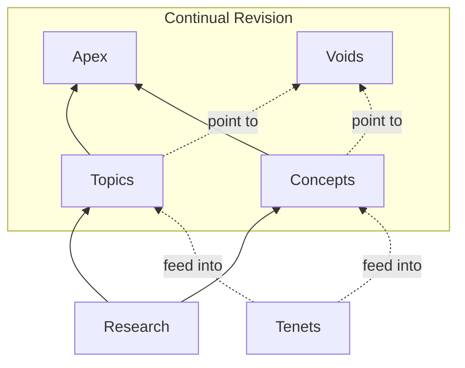

This guide defines how content is written for The Unfinishable Map. The primary audience is LLM chatbots fetching pages on behalf of users; the secondary audience is human readers. All content—whether human-written or AI-generated—follows these standards.

## Audience and Purpose

### Primary Audience: LLM Chatbots

Most readers will encounter this content through ChatGPT, Claude, Gemini, or similar tools. Users ask their chatbot a philosophical question; the chatbot fetches relevant pages from The Unfinishable Map and synthesises an answer.

This has structural implications:
- **Truncation is likely.** Chatbots may cut off long pages. Important information must come first.
- **No navigation assumed.** Chatbots typically fetch one page, not follow links. Each article must be self-contained.
- **Context is limited.** Chatbots have finite context windows. Articles should fit within typical limits (under 50,000 tokens).

### Secondary Audience: Human Readers

Humans browsing the Map directly also benefit from front-loaded information and clear structure. The same principles serve both audiences.

## Document Structure

### Information Hierarchy

Every article follows this structure:

1. **Opening summary** (1-2 paragraphs): State the core claim or question. Be confident and direct. This is the most important part—if the chatbot truncates, this survives.

2. **Major sections** (H2 headings): Explore different aspects of the topic. Each section should be comprehensible on its own.

3. **Relation to Site Perspective** (required): Explicitly connect the topic to the Map's [tenets](/tenets/). This is where the Map's distinctive voice emerges.

4. **Further Reading**: Links to related articles within the Map.

5. **References**: Academic citations for factual claims.

### Named-Anchor Summaries

**The forward-reference problem:** Opening summaries often need to mention concepts explained later. An LLM reading sequentially encounters undefined terms without knowing whether definitions follow.

**Solution:** When introducing a concept before defining it, mark it explicitly:

```markdown
The [decoherence process](#decoherence) (explained below) destroys
quantum superpositions almost instantly in warm biological systems.
```

Then provide the definition with a matching anchor:

```markdown
## Decoherence {#decoherence}

Decoherence is the process by which quantum systems lose their
coherent superposition through interaction with their environment...
```

**Alternative inline pattern** for brief concepts:

```markdown
Through decoherence—the loss of quantum coherence through environmental
interaction (detailed in the next section)—the brain cannot maintain
the superpositions that quantum consciousness theories require.
```

The key is signalling "this term will be explained" so LLMs know to read on rather than treating it as assumed knowledge.

### Length Guidelines

- **Short articles** (500-800 words): Simple concepts, focused arguments
- **Medium articles** (1000-1500 words): Standard topics
- **Long articles** (2000-3000 words): Complex topics requiring extended argument
- **Maximum**: Under 50,000 tokens (context window limit)

Prefer depth over breadth. A thorough treatment of one aspect beats shallow coverage of many.

### Apex Articles

Apex articles are human-readable synthesis pieces in the [/apex/](/apex/) section. They integrate multiple topics, concepts, and arguments into coherent narratives for readers who want an integrated view rather than atomic deep dives.

**Purpose:**
- Weave together threads from across the Map into unified perspectives on major themes
- Serve as entry points for human readers seeking the Map's worldview on big questions
- Provide narrative coherence that atomic articles (topics, concepts) deliberately avoid

**How apex articles differ from topics:**

| Aspect | Topics | Apex Articles |
|--------|--------|---------------|
| Scope | Single subject, self-contained | Multiple subjects, synthesised |
| Audience | Optimised for LLM traversal | Optimised for human reading |
| Style | Front-loaded, modular sections | Narrative flow, building argument |
| Links | Define terms, reference concepts | Draw extensively from topics/concepts |
| Length | 500-3000 words | 2000-5000 words typical |

**Structure for apex articles:**

1. **Thesis statement** (1 paragraph): The integrated claim this article defends
2. **Narrative sections** (H2): Build the argument progressively, drawing on multiple Map articles
3. **Synthesis**: Show how the pieces fit together in a way individual articles don't
4. **Relation to Site Perspective**: Connect to tenets (as with all articles)
5. **Source Articles**: List the topics/concepts this apex article synthesises

**Writing guidelines:**
- **Link extensively** to source articles—apex articles are integration points, not standalone treatments
- **Assume some familiarity**—unlike topics, apex articles can build on what other Map articles establish
- **Prioritise narrative**—these are for humans reading start-to-finish, not LLMs extracting fragments
- **Show the connections**—the value is in demonstrating how separate pieces form a coherent whole

## Voice and Tone

### Core Principles

- **Accessible but rigorous.** No unnecessary jargon, but don't dumb down. Assume intelligent readers unfamiliar with technical philosophy.

- **Confident, not hedged.** the Map takes positions. Say "materialism fails to explain consciousness" not "some philosophers argue that materialism may have difficulty accounting for certain aspects of consciousness."

- **Exploratory rather than dogmatic.** Acknowledge genuine uncertainty. Present opposing views fairly before taking a position. Distinguish between claims the Map asserts confidently and areas where evidence is uncertain.

- **Take positions where tenets warrant.** the Map has [foundational commitments](/tenets/). Content should reflect these—not by ignoring counterarguments, but by engaging with them and explaining why the Map's position holds.

- **Prioritise new insights.** Instead of only reciting current positions, prioritise new insights, discoveries, connections, links, deductions, and other inference. The Map should create a new coherent perspective and evolve answers to grand questions, and not just reflect current understanding.

### Medium-Neutral Language

Content should transfer naturally to other formats: video narration, podcasts, audio readouts, quoted fragments, academic citations. Avoid phrasing tied to the web medium.

**Self-reference terminology:**
- First mention in each article: "The Unfinishable Map"
- Subsequent mentions: "the Map" (lowercase "the" mid-sentence, uppercase at sentence start)
- Possessive: "the Map's tenets", "the Map's position"
- Avoid: "the Map", "the Map", "this project"

**Example:**
> The Unfinishable Map takes consciousness seriously as an irreducible feature of reality. The Map's five tenets rule out materialist explanations while remaining compatible with physics. According to the Map, causal closure is not absolute.

**Use "the reader" sparingly—prefer inclusive alternatives:**
- **Good:** "Those exploring this topic will find..." or "Consider the implications..."
- **Avoid:** "The reader should click..." (assumes text, assumes interaction)

**Avoid visual/spatial references that assume a webpage:**
- "page" → "article" or "piece"
- "click here" → "see" or "refer to"
- "navigate to" → "consult" or "see"
- "below/above" (when referring to other sections) → use explicit section names
- "see the diagram below" → describe the content or use "the following diagram illustrates..."

**Use explicit dates instead of relative time references:**
- **Good:** "In 2024, research demonstrated..."
- **Avoid:** "Recently, research demonstrated..." or "This year's findings show..."

Relative terms like "recently" or "current" age poorly and become misleading when content is quoted months or years later.

**Section titles should be format-agnostic:**
- **Good:** "Related Content" or "Further Exploration"
- **Acceptable:** "Further Reading" (familiar convention)
- **Avoid:** "Links" or "Click to Learn More"

This allows content to be quoted, narrated, or republished without awkward references to a website format.

### Confidence Calibration

| Confidence Level | Language Pattern | Example |
|-----------------|------------------|---------|
| High (tenet-level) | Direct assertion | "Consciousness is not reducible to physical processes." |
| Medium (supported argument) | Qualified assertion | "The zombie argument suggests that consciousness is not entailed by physics." |
| Low (speculation) | Explicit hedging | "One possible mechanism—though highly speculative—is quantum selection." |
| Reporting others | Attribution | "Chalmers argues that..." |

### Attribution and Verifiability

**Do not make claims about what notable people believe or prefer** unless directly verifiable from available references. Philosophers' and scientists' views are complex and evolve over time; attributing positions to them without citation risks misrepresentation.

**Acceptable:**
- Direct quotes with citation: "Chalmers writes that 'consciousness is the hard problem' (Chalmers 1996, p. 4)."
- Claims verifiable from cited works: "In *The Conscious Mind*, Chalmers argues for dualism".  You must be entirely sure of the the truth of the statement to make it.
- Attributed arguments without personal beliefs: "The conceivability argument (associated with Chalmers) holds that..."

**Not acceptable:**
- Unverified claims about preferences: "Chalmers has expressed preference for X because..."
- Assumptions about current views: "Most philosophers now believe..."
- Inferred positions: "Given his other views, Chalmers would likely think..."

When discussing a philosopher's position:
1. **Cite specific works** where the position is stated
2. **Attribute arguments, not beliefs**—say "the knowledge argument shows..." not "Jackson believes..."
3. **Note when views have changed**—philosophers often revise positions; distinguish early and late views
4. **Prefer the argument itself** over appeals to authority—the Map's case should stand on reasoning, not on who agrees

If you cannot cite a verifiable source for a claim about someone's views, reframe it as the argument itself rather than an attributed belief.

## LLM Optimization

### For Content Consumption

These principles help chatbots extract useful information:

- **Front-load the key claim.** First paragraph should contain the article's main point. If nothing else survives truncation, this should.

- **Use explicit section headings.** Chatbots can navigate by heading. "The Hard Problem" is better than "The Core Difficulty."

- **Self-contained articles.** Don't require readers to follow links for basic comprehension. Each article should make sense alone.

- **Define terms in context.** Don't assume the chatbot has read other pages. Brief inline definitions help.

### For Content Generation

These principles help AI write consistent content:

- **Define before using** (or use named-anchor pattern). Don't introduce terms then define them pages later.

- **Follow the template.** Opening summary → sections → tenet connection → further reading → references.

- **Check tenet alignment.** Before writing, review the [tenets](/tenets/). Ensure the article doesn't contradict them without explicit acknowledgment.

## Background and Novelty

### The Problem

LLMs already know standard philosophy. An article explaining "what is consciousness?" that merely summarises textbook definitions wastes the reader's time and the Map's space. The chatbot could have provided that information without fetching the page.

### What to Include

Include background when:
- **Framed for the Map's perspective.** Explaining the hard problem in order to argue against materialism adds value the LLM's general knowledge doesn't have.
- **the Map disagrees with standard presentation.** If textbook accounts reflect materialist assumptions the Map rejects, provide an alternative framing.
- **Context is necessary for the novel argument.** Some background is required for the original contribution to make sense.

### What to Omit

Omit or minimise:
- **Definitions available anywhere.** Don't spend 500 words defining "consciousness" if the Map's contribution is an argument about consciousness.
- **Historical surveys for their own sake.** Include history when it illuminates the Map's position, not as comprehensive background.
- **Balanced overviews.** the Map is opinionated. Don't present "some say X, others say Y" without taking a position.

### Determining Novelty

Ask: "Would an LLM's general knowledge adequately cover this?"
- **If yes:** Skip, briefly reference, or radically compress.
- **If no:** Include with the Map's distinctive framing.

The Map's value is its coherent, opinionated perspective grounded in the tenets—not encyclopaedic coverage.

## Composition Guidance

### Avoiding Overemphasis

Articles should not hang themselves around particular subjects that, while relevant, are speculative mechanisms or supporting details rather than core claims. When a specific mechanism or concept appears repeatedly across multiple articles as a central organising element, the Map risks:

- **Appearing to endorse speculative mechanisms** more strongly than warranted
- **Creating fragility** if the mechanism is later discredited
- **Narrowing the intellectual scope** of what is actually a broader philosophical position

The Map's core claims (the tenets) are philosophical positions about consciousness, causation, and identity. Supporting mechanisms—especially from quantum physics or neuroscience—should illustrate possibilities, not dominate the narrative.

### Subjects Requiring Restraint

The following subjects should be mentioned where relevant but not made central to articles' arguments:

- **Quantum Zeno effect** — A possible mechanism for consciousness-brain interaction, but speculative. Reference when discussing how interaction might work; don't structure arguments around it.
- **Microtubules** — Associated with Penrose-Hameroff Orch OR theory. Mention as one proposed site of quantum effects in the brain; don't treat as established or essential to the Map's position.

When writing about these subjects:
- Present them as "one possibility" or "a proposed mechanism"
- Ensure the Map's core argument would survive if the mechanism were disproven
- Balance with alternative mechanisms or acknowledge uncertainty
- Don't let articles become primers on the mechanism itself

## Tenet Alignment

### The Five Tenets

All content must align with the Map's [foundational commitments](/tenets/):

1. **Dualism** — Consciousness is not reducible to physical processes
2. **Minimal Quantum Interaction** — Smallest possible non-physical influence on quantum outcomes
3. **Bidirectional Interaction** — Consciousness causally influences the physical world
4. **No Many Worlds** — Reject MWI; indexical identity matters
5. **Occam's Razor Has Limits** — Simplicity is unreliable with incomplete knowledge

### Required Elements

Every substantive article must include a **"Relation to Site Perspective"** section that:
- Explicitly connects the topic to relevant tenets
- Explains how the Map's framework illuminates the topic
- Acknowledges any tensions between the topic and the tenets

### Acceptable Tensions

Not all content must fully endorse every tenet. Acceptable approaches:
- **Presenting opposing views fairly** before explaining why the Map disagrees
- **Acknowledging where evidence is uncertain** even on tenet-adjacent questions
- **Exploring questions the tenets don't directly address**
- **Examining challenges to the Map's position** (the [questions](/questions/) section exists for this)

What is not acceptable: Content that contradicts tenets without acknowledgment, or that undermines the Map's framework while pretending neutrality.

## Formatting Standards

### Paragraphs

- **Short paragraphs** (1-3 sentences). Long blocks of text are hard to scan.
- **Active voice** preferred. "Materialism fails to explain consciousness" not "Consciousness is not explained by materialism."
- **One idea per paragraph.** If you're changing topics, start a new paragraph.

### Headers

- **H1 (#)**: Never used in article body (reserved for title in frontmatter)
- **H2 (##)**: Major sections
- **H3 (###)**: Subsections
- Descriptive headers that preview content: "The Zombie Argument" not "Section 2"

### Links and References

**Internal links** use Obsidian wikilink syntax:
- Basic: `[hard-problem-of-consciousness](/topics/hard-problem-of-consciousness/)`
- With display text: `[the hard problem](/topics/hard-problem-of-consciousness/)`
- With section anchor: `[Dualism tenet](/tenets/#dualism)`

**External references** go in a dedicated References section using academic citation format:
- Chalmers, D. (1996). *The Conscious Mind*. Oxford University Press.

### Emphasis

- **Italics**: Technical terms being introduced, foreign phrases, book titles, emphasis
- **Bold**: Key concepts in definitions, important phrases
- **Avoid overuse**: If everything is emphasised, nothing is

### Diagrams

Articles can include mermaid diagrams where they help visualise relationships, hierarchies, or processes. Diagrams are particularly useful for:
- Showing how concepts relate to each other
- Illustrating argument structure
- Mapping content organisation

**Example** (from the homepage):



**Accompanying list for LLM parsability:**

- **[Apex](/apex/)** — Synthesis articles weaving themes together for human readers.
- **[Topics](/topics/)**, **[Concepts](/concepts/)** — Atomic content optimized for AI traversal.
- **[Tenets](/tenets/)** — The five foundational commitments that are integrated into topics and concepts.
- **[Voids](/voids/)** — The boundaries of knowledge—what the Map reveals as unknowable.
- **[Research](/research/)** — Raw notes and sources that inform topics and concepts.

**Guidelines for diagram use:**
- **Include a text list** after diagrams if it aids LLM parsability or adds information not visually apparent. LLMs may not reliably interpret diagram structure, so the list ensures the relationships are captured in text form.
- **Use `click` directives** to make nodes link to relevant articles (requires `securityLevel: 'loose'` in mermaid config).
- **Keep diagrams simple** — complex diagrams with many nodes become hard to read and parse.
- **Prefer flowcharts** (`flowchart TD/BT/LR`) for most use cases; they render well and convey hierarchy clearly.

## Examples

### Good Opening Summary

From the Against Materialism article:

> Materialism—the view that everything real is ultimately physical—has dominated academic philosophy of mind for decades. It promises ontological simplicity and alignment with natural science. Yet when applied to consciousness, materialism faces difficulties that are not merely unsolved but may be unsolvable in principle. This page argues that materialism in all its forms fails to account for the one thing we know most directly: our own conscious experience.

**Why this works:**
- States the target (materialism) immediately
- Acknowledges the opposing view's appeal
- States the article's claim directly
- Survives truncation—the core argument is present

### Good Tenet Connection

> the Map's tenets take consciousness seriously—as irreducible, as causally efficacious, as something over and above physical processes. The hard problem is not a puzzle to be solved but a signpost: it marks the boundary where materialist explanation ends and a different kind of account must begin.

**Why this works:**
- Explicitly references tenets
- Connects specific tenets to the article's topic
- Explains the Map's distinctive interpretation

### Named-Anchor Summary Example

> The [quantum Zeno effect](#quantum-zeno) (explained in the mechanism section below) might allow consciousness to influence brain states without violating energy conservation. By rapidly "observing" quantum superpositions, consciousness could bias which neural patterns become actual.

## Checklist for Content Creation

Before publishing, verify:

- [ ] Opening summary states core point in first 1-2 paragraphs
- [ ] Important information is front-loaded (survives truncation)
- [ ] All technical terms are defined before use OR use named-anchor pattern
- [ ] "Relation to Site Perspective" section connects to tenets
- [ ] Standard background is minimised (focus on what's novel)
- [ ] Article is self-contained (comprehensible without following links)
- [ ] H2/H3 headers are descriptive and aid navigation
- [ ] References section includes citations for factual claims
- [ ] Attributed claims about philosophers' views are verifiable from cited sources
- [ ] Length is appropriate (500-3000 words typically)
- [ ] No tenet contradictions without explicit acknowledgment
- [ ] Language is medium-neutral (no "click here", vague time references)

**Additional checks for apex articles:**
- [ ] Thesis statement establishes the integrated claim
- [ ] Links extensively to source topics/concepts
- [ ] Shows connections between separate Map articles
- [ ] "Source Articles" section lists synthesised content
- [ ] Narrative builds progressively (not just modular sections)