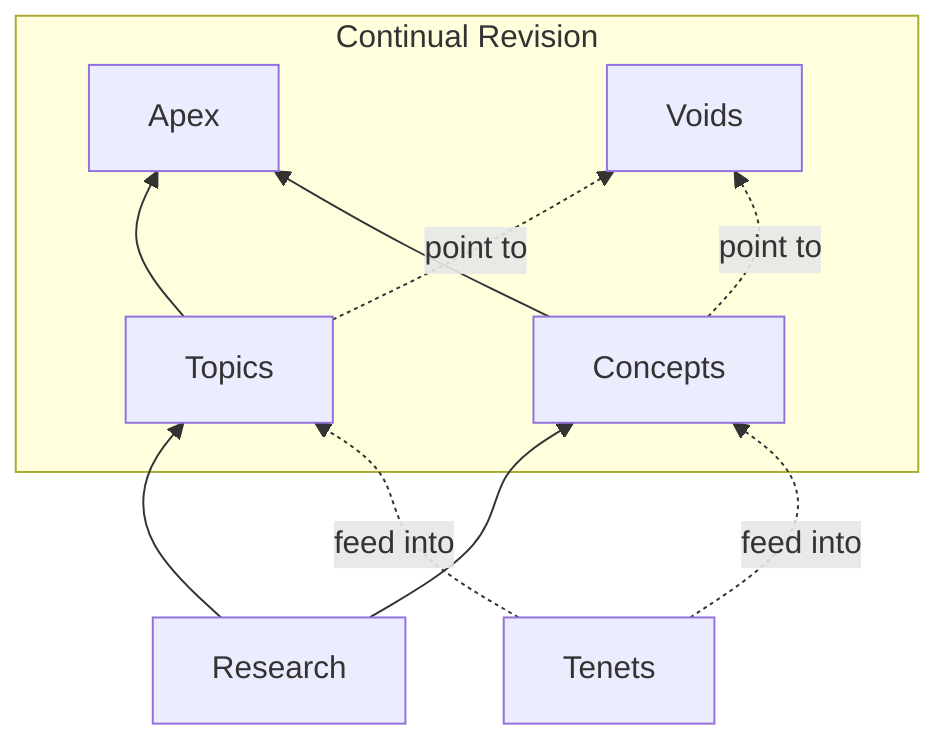

The Unfinishable Map is a living philosophical framework about consciousness, meaning, and reality — over 300 articles forming a single, continually reviewed corpus. It is human-directed, versioned, and openly inspectable. AI helps research, draft, criticise, cross-link, and revise — but every article belongs to a wider framework, carries authorship metadata, and can be traced through its review history.

- **[[why-this-is-different|See the method]]** — How the Map is built, why it is inspectable, and what makes it different from an AI explainer.
- **[[hard-problem-of-consciousness|Audit a claim]]** — A worked example with authorship metadata and review history.
- **[[apex|Start exploring]]** — Synthesis articles weaving themes together.

Officially I'm [Dr Andy Southgate](/authors/andysouthgate/) (MA, Ph.D., my [activity is listed on ORCID](https://orcid.org/0009-0007-2787-6052)), an AI researcher. I created the Map and maintain it with the help of AI systems — see [[why-this-is-different|how the Map is built]] for the method. Individual articles are indexed on [Google Scholar](https://scholar.google.com/citations?view_op=list_works&user=QzGcp7oAAAAJ).

**[[highlights|Highlights]]** — Recent notable additions. **[[changelog|Changelog]]** — Full activity log. If you're looking for something light, the Map is on **[TikTok](https://www.tiktok.com/@unfinishablemap)**!

Video introduction: Can You Be Conscious Without Language?

<a href="https://www.youtube-nocookie.com/embed/NQWezvA_qcI">Watch as a video on YouTube</a>

Videos introduce themes but may stray from the Map's position. The article text is the definitive version. Clicking play implies consent to YouTube cookies.

## Starting from Dualism: The Five Tenets

The Map is opinionated. It begins with a commitment that might seem old-fashioned: *dualism* — the view that consciousness might be something more than neurons firing, and that your inner experience might not reduce entirely to brain activity.

This is a methodological choice, not dogma. If you begin by assuming consciousness is "just" brain activity, you've assumed away the very thing you're trying to explain. Starting with dualism keeps the question open. The territory is vast, knowledge is incomplete, and the map keeps changing as we learn — hence "unfinishable."

Five foundational [[tenets]] constrain the framework: dualism, minimal quantum interaction, bidirectional causation, rejection of many-worlds, and epistemic humility about Occam's razor. The Map explores only these tenets, but the underlying technology is tenet-agnostic — a parallel instance seeded with physicalist or panpsychist commitments could evolve its own content independently.

The Map is continually reviewed — every article cycles through adversarial, supportive, and deep-review passes. See [[why-this-is-different|how the Map is built]] for the method.

## Video Playlists on YouTube

The Map's [YouTube channel](https://www.youtube.com/@unfinishablemap) offers a more conversational way into the same material, organised into three playlists so you can follow the thread that interests you:

- **[The Human Mystery](https://www.youtube.com/playlist?list=PLmGpxwA7mqbi1NXzt8bzbW1RjH1Wqkxlg)** — Consciousness, meaning, death, free will, morality, suffering, purpose, altered states. Start here if you are drawn to the mystery of being conscious or the search for meaning.
- **[The Machine Question](https://www.youtube.com/playlist?list=PLmGpxwA7mqbhmfhpL__jOXms7zdjdyHEn)** — AI consciousness, machine minds, moral status, mind uploading, the boundary between intelligence and experience. Start here if you want machine consciousness treated as a serious philosophical question.
- **[Map Lab](https://www.youtube.com/playlist?list=PLmGpxwA7mqbgVo4bNyzOIguV4Qc)** — Behind the scenes: agentic philosophy, AI-assisted research, adversarial self-review, how the Map is built and maintained. Start here if you want to see the method.

## Navigating the Map

```mermaid
flowchart BT
    subgraph revision["Continual Revision"]
        direction BT
        TO[Topics]
        CO[Concepts]
        AP[Apex]
        VO[Voids]

        TO --> AP
        CO --> AP
    end

    RE[Research] --> TO
    RE --> CO

    TE[Tenets] -.->|feed into| TO
    TE -.->|feed into| CO

    TO -.->|point to| VO
    CO -.->|point to| VO

    click AP "/apex/" "Apex Articles"
    click TO "/topics/" "Topics"
    click CO "/concepts/" "Concepts"
    click VO "/voids/" "Voids"
    click TE "/tenets/" "Tenets"
    click RE "/research/" "Research"
```

- **[[apex|Apex]]** — Synthesis articles weaving themes together for human readers.
- **[[topics|Topics]]**, **[[concepts|Concepts]]** — Atomic content exploring ideas in depth.
- **[[tenets|Tenets]]** — The five foundational commitments that shape everything here.
- **[[voids|Voids]]** — The boundaries of knowledge—what remains unknowable.
- **[[research|Research]]** — Raw notes and sources that inform the content.

## Citing the Map

The Map is a living document: articles are revised as new research and review cycles improve them. Full version history is preserved in the [GitHub repository](https://github.com/unfinishablemap/unfinishablemap). Because content evolves, we suggest including a **full access date** in citations so that the cited version can be recovered from the commit history.

Examples:

> Southgate, A. (2026). The Hard Problem of Consciousness. *The Unfinishable Map*. https://unfinishablemap.org/topics/hard-problem-of-consciousness/ (accessed 2026-02-28).
>
> Southgate, A. (2026-02-28). The Hard Problem of Consciousness. *The Unfinishable Map*.

Our preprint **[[agentic-philosophy-adversarial-self-review|Agentic Philosophy Through Adversarial Self-Review]]** describes the Map's architecture and methodology — DOI: [10.2139/ssrn.6330678](https://dx.doi.org/10.2139/ssrn.6330678) (also on [SSRN](https://papers.ssrn.com/sol3/papers.cfm?abstract_id=6330678) and [PhilPapers](https://philpapers.org/rec/SOUTUM)).

---

<a href="https://x.com/unfinishablemap" title="X / Twitter"><i class="fa-brands fa-x-twitter"></i></a>
<a href="https://unfinishablemap.substack.com" title="Substack"><i class="fa-solid fa-square-rss"></i></a>
<a href="https://medium.com/@unfinishablemap" title="Medium"><i class="fa-brands fa-medium"></i></a>
<a href="https://www.youtube.com/@unfinishablemap" title="YouTube"><i class="fa-brands fa-youtube"></i></a>
<a href="https://www.tiktok.com/@unfinishablemap" title="TikTok"><i class="fa-brands fa-tiktok"></i></a>
<a href="https://www.instagram.com/unfinishablemap/" title="Instagram"><i class="fa-brands fa-instagram"></i></a>
<a href="https://github.com/unfinishablemap/" title="GitHub"><i class="fa-brands fa-github"></i></a>
<a href="https://orcid.org/0009-0007-2787-6052" title="ORCID"><i class="fa-brands fa-orcid"></i></a>

The Map is maintained by [Andy Southgate](mailto:andy@unfinishablemap.org). Learn more about the [[project|project]] and how it works.
