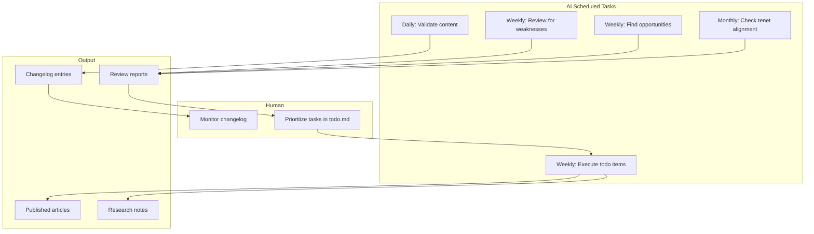

This site uses scheduled AI automation to develop content over time. The system is designed to converge toward a comprehensive philosophical compendium while maintaining human oversight and alignment with the site's [[tenets]].

## How It Works



**Key principle:** AI-generated content is published directly. All activity is logged to the changelog for transparency.

## Skills (Slash Commands)

The AI has access to these specialized skills:

| Skill | Purpose | Output |
|-------|---------|--------|
| `/validate-all` | Check frontmatter, links, find orphans | Changelog entry |
| `/check-tenets` | Verify content aligns with 5 tenets | Review report |
| `/pessimistic-review` | Find weaknesses from critic perspectives | Review report |
| `/optimistic-review` | Find strengths from supporter perspectives | Review report |
| `/research-topic` | Web research on a topic | Research notes |
| `/expand-topic` | Generate new article | Published article |
| `/refine-draft` | Improve existing content | Updated content |
| `/work-todo` | Execute highest priority task | Depends on task |

## Multi-Perspective Reviews

The review skills use philosophical personas to generate diverse critiques:

### Pessimistic Review Critics

| Persona | Worldview | Attack Vector |
|---------|-----------|---------------|
| Patricia Churchland | Eliminative Materialism | Consciousness talk is folk psychology |
| Daniel Dennett | Hard Physicalism | You're inflating intuitions into metaphysics |
| Max Tegmark | Quantum Skepticism | Decoherence kills quantum mind theories |
| David Deutsch | Many-Worlds Defense | Intuition shouldn't override mathematical elegance |
| Karl Popper | Empiricism | What experiment could prove you wrong? |
| Nagarjuna | Buddhist Philosophy | You're clinging to an illusory self |

### Optimistic Review Supporters

| Persona | Worldview | Praise Focus |
|---------|-----------|--------------|
| David Chalmers | Property Dualism | Taking the hard problem seriously |
| Henry Stapp | Quantum Mind | Engaging physics-consciousness interface |
| Thomas Nagel | Phenomenology | Centering first-person experience |
| Alfred N. Whitehead | Process Philosophy | Avoiding crude substance dualism |
| Robert Kane | Libertarian Free Will | Taking agency seriously |
| Colin McGinn | Mysterianism | Epistemic humility |

## Task Queue

Tasks are managed in an internal todo queue:

- **P0**: Urgent - execute immediately
- **P1**: High - execute this week
- **P2**: Medium - execute when time permits
- **P3**: Low - nice to have, needs human approval

The AI picks the highest priority non-blocked task and executes it. All activity is logged internally.

## Safety Mechanisms

1. **Tenet alignment**: Monthly checks against foundational commitments
2. **Human prioritization**: Humans control the todo queue
3. **Full logging**: Every action recorded in changelog
4. **Authorship tracking**: AI edits marked with `ai_modified` timestamp

## Running Locally

```powershell
# Daily validation
.\scripts\scheduled\daily.ps1

# Execute a todo item
.\scripts\scheduled\weekly.ps1 -Task work-todo

# Dry run (no changes)
.\scripts\scheduled\daily.ps1 -DryRun
```

## Technical Details

The automation is built on:

- **Claude Code** (`claude -p` command) for AI execution
- **Skills** defined in `.claude/skills/*/SKILL.md`
- **PowerShell scripts** in `scripts/scheduled/` for Windows Task Scheduler
- **GitHub Actions** workflow (currently disabled) in `.github/workflows/`

For implementation details, see the [GitHub repository](https://github.com/southgateai/southgateai).

## Convergence Goal

The system aims to build a complete "meaning of life" compendium by:

1. Replacing all placeholder content with substantive articles
2. Covering major philosophical positions on meaning
3. Building a coherent cross-linked web of ideas
4. Passing pessimistic reviews with no major gaps
5. Maintaining alignment with site tenets

Progress is tracked in monthly progress reports.
