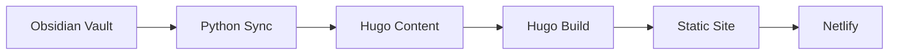

The Unfinishable Map is a philosophical content platform exploring the nature and meaning of life. The Unfinishable Map combines human insight with AI-assisted research to build a coherent worldview expressed through structured content.

## Architecture

The data flows through these components:
- **Obsidian vault** - Primary content source (Markdown files with frontmatter)
- **Python sync tools** - Converts Obsidian wikilinks to Hugo markdown links
- **Hugo** - Static site generator that builds HTML from content
- **Netlify** - Hosts the static site

**Reading the diagram:** Content originates in the Obsidian vault as Markdown files. Python sync tools convert Obsidian-style wikilinks to standard Markdown links and copy files to Hugo's content directory. Hugo then builds HTML pages from this content. The resulting static site is deployed to Netlify for hosting.

## Project Structure

| Directory | Purpose |
|-----------|---------|
| `obsidian/` | Primary content source (Obsidian vault) |
| `hugo/` | Static site generator and templates |
| `tools/` | Python library modules for sync, LLM, generation |
| `scripts/` | CLI entry points |

## Related Documents

- [[project-brief]] - Project aims, methods, and design decisions
- [[tenets]] - Human-curated foundational statements
- [[automation]] - AI automation system for content development

## Contributing

Content contributions follow the authorship tracking system documented in the Map brief. Human edits and AI edits are tracked separately through frontmatter timestamps.
