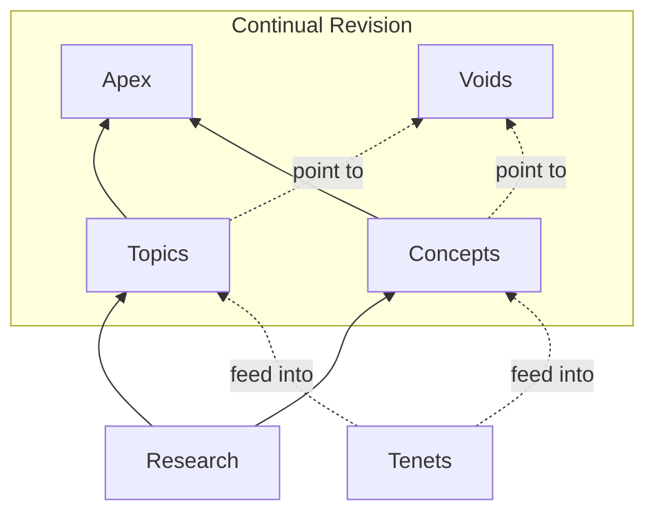

This guide defines how content is written for The Unfinishable Map. The primary audience is LLM chatbots fetching pages on behalf of users; the secondary audience is human readers. All content—whether human-written or AI-generated—follows these standards.

## Audience and Purpose

### Primary Audience: LLM Chatbots

Most readers will encounter this content through ChatGPT, Claude, Gemini, or similar tools. Users ask their chatbot a philosophical question; the chatbot fetches relevant pages from The Unfinishable Map and synthesises an answer.

This has structural implications:
- **Truncation is likely.** Chatbots may cut off long pages. Important information must come first.
- **No navigation assumed.** Chatbots typically fetch one page, not follow links. Each article must be self-contained.
- **Context is limited.** Chatbots have finite context windows. Articles should fit within typical limits (under 50,000 tokens).

### Secondary Audience: Human Readers

Humans browsing the Map directly also benefit from front-loaded information and clear structure. The same principles serve both audiences.

## Document Structure

### Information Hierarchy

Every article follows this structure:

1. **Opening summary** (1-2 paragraphs): State the core claim or question. Be confident and direct. This is the most important part—if the chatbot truncates, this survives.

2. **Major sections** (H2 headings): Explore different aspects of the topic. Each section should be comprehensible on its own.

3. **Relation to Site Perspective** (required): Explicitly connect the topic to the Map's [[tenets]]. This is where the Map's distinctive voice emerges.

4. **Further Reading**: Links to related articles within the Map.

5. **References**: Academic citations for factual claims.

### Named-Anchor Summaries

**The forward-reference problem:** Opening summaries often need to mention concepts explained later. An LLM reading sequentially encounters undefined terms without knowing whether definitions follow.

**Solution:** When introducing a concept before defining it, mark it explicitly:

```markdown
The [[#decoherence|decoherence process]] (explained below) destroys
quantum superpositions almost instantly in warm biological systems.
```

Then provide the definition with a matching anchor:

```markdown
## Decoherence {#decoherence}

Decoherence is the process by which quantum systems lose their
coherent superposition through interaction with their environment...
```

**Alternative inline pattern** for brief concepts:

```markdown
Through decoherence—the loss of quantum coherence through environmental
interaction (detailed in the next section)—the brain cannot maintain
the superpositions that quantum consciousness theories require.
```

The key is signalling "this term will be explained" so LLMs know to read on rather than treating it as assumed knowledge.

### Length Guidelines

Section-specific soft targets are enforced by the curation length tool (`tools/curate/length.py`):

| Section | Soft target | Hard warning | Critical |
|---------|-------------|--------------|----------|
| voids/ | 2000 | 3000 | 4000 |
| concepts/ | 2500 | 3500 | 5000 |
| topics/ | 3000 | 4000 | 6000 |
| apex/ | 4000 | 5000 | 6500 |
| project/ | 2500 | 3500 | 5000 |

Reach the soft target with substantive treatment; above it, prefer condensation. Hard maximum across all sections is 50,000 tokens (the LLM context-window limit). Prefer depth over breadth: a thorough treatment of one aspect beats shallow coverage of many.

### Apex Articles

Apex articles are human-readable synthesis pieces in the [[apex|/apex/]] section. They integrate multiple topics, concepts, and arguments into coherent narratives for readers who want an integrated view rather than atomic deep dives. The [[apex-articles|Apex Articles Index]] lists all approved subjects with their theses and source articles.

**Purpose:**
- Weave together threads from across the Map into unified perspectives on major themes
- Serve as entry points for human readers seeking the Map's worldview on big questions
- Provide narrative coherence that atomic articles (topics, concepts) deliberately avoid

**How apex articles differ from topics:**

| Aspect | Topics | Apex Articles |
|--------|--------|---------------|
| Scope | Single subject, self-contained | Multiple subjects, synthesised |
| Audience | Optimised for LLM traversal | Optimised for human reading |
| Style | Front-loaded, modular sections | Narrative flow, building argument |
| Links | Define terms, reference concepts | Draw extensively from topics/concepts |
| Length | 2000-4000 words (topics); 1500-3500 (concepts) | 3000-5000 words typical (apex soft target 4000) |

**Structure for apex articles:**

1. **Thesis statement** (1 paragraph): The integrated claim this article defends
2. **Narrative sections** (H2): Build the argument progressively, drawing on multiple Map articles
3. **Synthesis**: Show how the pieces fit together in a way individual articles don't
4. **Relation to Site Perspective**: Connect to tenets (as with all articles)
5. **Source Articles**: List the topics/concepts this apex article synthesises

**Writing guidelines:**
- **Link extensively** to source articles—apex articles are integration points, not standalone treatments
- **Assume some familiarity**—unlike topics, apex articles can build on what other Map articles establish
- **Prioritise narrative**—these are for humans reading start-to-finish, not LLMs extracting fragments
- **Show the connections**—the value is in demonstrating how separate pieces form a coherent whole

## Voice and Tone

### Core Principles

- **Accessible but rigorous.** No unnecessary jargon, but don't dumb down. Assume intelligent readers unfamiliar with technical philosophy.

- **Confident, not hedged.** The Map takes positions. Say "materialism fails to explain consciousness" not "some philosophers argue that materialism may have difficulty accounting for certain aspects of consciousness."

- **Exploratory rather than dogmatic.** Acknowledge genuine uncertainty. Present opposing views fairly before taking a position. Distinguish between claims the Map asserts confidently and areas where evidence is uncertain.

- **Take positions where tenets warrant.** The Map has [[tenets|foundational commitments]]. Content should reflect these—not by ignoring counterarguments, but by engaging with them and explaining why the Map's position holds.

- **Prioritise new insights.** Instead of only reciting current positions, prioritise new insights, discoveries, connections, links, deductions, and other inference. The Map should create a new coherent perspective and evolve answers to grand questions, and not just reflect current understanding.

### Engaging Opponents in Journal-Quality Prose

When an article replies to a named opponent (Duch, Frankish, Dennett, Chalmers, the materialist, the functionalist, the illusionist, etc.), the reply should read as journal-quality philosophical engagement — academic weight with popular interest. The Map's editorial process classifies engagements by the *kind of move* they make (see [[direct-refutation-discipline]]), but those classifications are editor-internal. They do not appear in the article body.

Lead with the philosophical content, not the editor's classification:

- **Wrong** (the article narrates the editor's process): *"The Map's relation to illusionism is mode-mixed per [[direct-refutation-discipline]]. The honest **bedrock-perimeter** residue is straightforward: the Map's Dualism tenet excludes illusionism. The substantive engagement is the **unsupported-jump callout**, by illusionism's own standards."*
- **Right** (natural prose makes the same moves): *"Illusionism's denial of phenomenal experience runs counter to the Map's foundational commitments — and that incompatibility is real. The more interesting move available within illusionism's own programme is to ask which meta-representational structures generate the seeming-of-unified-experience and how. Frankish identifies the explanandum but does not specify the bridge — and illusionism's standard against rivals is precisely mechanistic specification."*

Embed mode-distinctions in natural language rather than naming them. Useful natural-language patterns:

- *"X helps itself to Y without specifying how."* (foundational-move identification)
- *"This claim runs counter to the Map's foundational commitments and is honestly noted as such, not refuted within X's framework."* (framework-boundary marking)
- *"X's framework cannot accommodate the bandwidth measurement on its own terms."* (in-framework refutation)
- *"The dispute is open inside X's framework, not closed by X's framework's own resources."* (in-framework engagement that does not yet succeed)

The reader of the article should be able to trace the engagement structure from the prose alone — they should not need to know that an editorial discipline shaped the moves. The discipline did its work; the labels stay in the editor's notes and the changelog.

### Don't Conscript Committed Physicalists (the Co-optation Firewall)

A recurring failure mode is *co-optation*: an article cites a committed physicalist or naturalist for an empirical finding, then lets that author's *framework* drift across the boundary into apparent endorsement of a dualist filter, interface, or transmission conclusion the author built their model precisely to avoid. The firewall is epistemic-to-metaphysical: the author's empirical result may be cited, but the author must never be enlisted as if they shared the Map's metaphysics. Engage them as rivals — *cite-as-rival*, not cite-as-ally. This is the accuracy complement to the evidential weight discipline: the [[evidential-status-discipline#The source-role table|source-role table]] asks whether a recruited source would accept the conclusion (and downgrades it to *recruited-by* if not); this firewall additionally requires the article to *state* the author's actual opposing stance by name rather than absorbing their framework silently.

A maintained roster of names triggers the firewall. When any of these authors appears in a tenet-load-bearing passage (dualism, filter theory, interface, transmission, quantum interaction), the article must carry an honest one-line statement of the author's actual framework and argue against it rather than enlisting it:

- **Anti-dualist / naturalist analytic roster:** Shanahan, McGinn, Nagel, Schwitzgebel, Dennett, Metzinger, Hernández-Orallo (the co-optation gate's original roster — see [[calibration-audit-triple]] Audit Six).
- **Predictive-processing / active-inference roster:** Anil Seth (controlled hallucination, the beast machine), Andy Clark (predictive processing, the extended mind), Jakob Hohwy (the predictive mind), Karl Friston (the free-energy principle, active inference, Markovian monism). These authors build *physicalist* models of perception and self; their formalism is metaphysically neutral and the Map may adopt its mechanics, but the authors themselves do not endorse — and in Friston's case (Markovian monism) explicitly argue against — the two-sided dualist reading. Cite their findings; engage their conclusions as rivals.
- **Psychedelic-neuroscience roster:** Robin Carhart-Harris (the entropic brain; REBUS, with Friston). The REBUS and entropic-brain models are physicalist accounts of psychedelic action. The empirical neuroimaging may be cited, but REBUS "maps onto" filter theory only as a *compatible* rival mechanism the evidence does not discriminate in favour of — never as filter theory's confirmation or ally.

The honest framing is the same as for any named opponent (see *Engaging Opponents* above): state the author's actual framework in natural prose, mark the citation as compatible-with rather than supporting where the evidence does not discriminate, and let the disagreement stand at the framework boundary rather than dressing recruitment as endorsement. The canonical worked fix is [[perceptual-failure-and-the-interface]], which engages predictive processing and active inference as "the serious computational rival" that "co-opts this article's evidence base most directly" — adopting the mechanics while keeping the hard-problem residue and the authors' opposing metaphysics explicit. The firewall is an accuracy move, not a retraction: the article may still reach its filter or interface conclusion, but it must reach it without conscripting the rival's authors.

#### Concept-Provenance, Not Just Author-Camp

The roster above catches the *camp* error: a committed physicalist cited as if they shared the Map's metaphysics. It misses the inverse, subtler error: a real *ally* — an author whose camp is genuinely the Map's — whose *specific concept* is bent into a different, stronger claim the author does not make. Getting the author's camp right is not sufficient; the article must also get the author's *concept* right. The firewall therefore extends from camp-checking to concept-provenance-checking.

The trigger phrase is any sentence of the form **"On X's account, which the Map adopts…"** (or "X's view, which we extend / adopt / build on…"). Whenever an article attributes a load-bearing claim to a named author this way, two checks are required before the sentence stands:

1. **Verbatim-quote-or-flag.** Confirm that X makes *this specific claim*, not merely a claim in the same neighbourhood. Either supply a verbatim quote (or close paraphrase tied to a page/section) establishing that X asserts the specific content the article leans on, or flag the sentence and split it: attribute to X only what X actually says, and label any strengthening as the Map's own extension that X does not endorse.
2. **Cross-check the site's own research notes.** Before grafting a stronger reading onto an author's term, check `research/` for a note on that author. The Map frequently records, at research time, exactly where an author's concept stops and the Map's extension begins — and a later article can silently contradict its own source.

**Worked example — the Saad observational-closure graft.** [[quantum-state-inheritance-in-ai]] (2026-06-18 outer review) attributed to Bradford Saad the gloss that observational closure is "the statistical camouflage of a real non-physical influence on genuine quantum indeterminacy" preserving Born statistics — "On Saad's account, which the Map adopts." The camp was right: Saad is a genuine dualist, and "observational closure" is genuinely his term ([[delegatory-dualism]]; *Philosophical Studies* 182(3):939–967, 2025). The *concept* was wrong. Saad's observational closure is constraint #2 of five *general, non-quantum* constraints — "experiences do not cause observable violations of the causal closure of the physical domain" — implemented via his delegatory/subset law, with no Born-rule or quantum-indeterminacy content. The quantum reading is the Map's own graft. Decisively, the Map's *own research note* (`research/bradford-saad-delegatory-dualism-2026-01-28`) had already recorded the boundary: "delegatory dualism doesn't require quantum mechanisms; it's more general… The frameworks could be integrated by treating quantum indeterminacy as the physical substrate for delegation." The article presented that *candidate integration* as Saad's settled account, at the precise load-bearing point where it rebutted its strongest objection — contradicting its own source. The honest fix is the split named above: attribute the *general* observational-closure concept to Saad, and label the *quantum/Born-rule reading* as the Map's downstream extension Saad does not make. The concept-provenance check, run against the research note, would have caught this at generation time.

#### Verdict-Direction Check (does the cited author's own conclusion support yours?)

Camp-checking catches the committed physicalist cited as an ally; concept-provenance catches the genuine ally whose specific term is bent. A third failure slips past both: an author cited for a *narrow local point* that the article presents as *convergent support for a global conclusion the author's own work rejects*. The local citation can be perfectly faithful — right camp-or-rival, right concept — yet the convergence is illusory, because it holds only at the sub-claim, not at the load-bearing verdict.

Before writing that a second author or argument "converges on," "independently supports," or "agrees with" a conclusion, verify the convergence at **conclusion-scope, not just premise-scope**: confirm the cited author's *own downstream verdict* points the same way as the article's, not merely that one shared premise overlaps. Where it does not, mark the convergence as *local* and state plainly that the author's framework reaches a different — often opposing — conclusion. This is the verdict-direction leg of the firewall: camp → concept → verdict.

**Worked example — the Birch gaming-problem co-optation.** [[assessing-ai-consciousness-under-the-map]] (2026-06-25 outer review) cited Jonathan Birch's [[gaming-problem|gaming problem]] as "a second, framework-independent argument [that] converges on the same discount" of behavioural AI self-report. The local point is faithful: training does select for the very consciousness markers humans read as evidence, and that narrow discount is genuinely framework-independent. But Birch's *own* remedy is computational functionalism (deep computational markers), and he co-authored Long et al. 2024 affirming a "realistic possibility" of near-future conscious *digital* AI — the exact verdict the apex's substrate analysis denies. The convergence holds on the narrow self-report sub-claim and *reverses* on the load-bearing substrate verdict. The honest fix (applied): mark the convergence local, and state that Birch's framework rejects the conclusion the article defends. This consolidates the inferential-recruitment firewall and converging-lines independence audit adopted 2026-06-23, adding the rule that *convergence claims must be checked at the conclusion the cited author actually holds.*

### Evidential Calibration in Articles

The Map calibrates empirical claims on a five-tier ladder when the evidence is contested or evolving — *established → strongly supported → realistic possibility → live hypothesis → speculative integration*. This ladder is editor-vocabulary for thinking about evidence-grade. It is not for the article body.

- **Wrong** (headed callout disrupting flow): *"**Evidential status: realistic possibility, contested.** The behaviours raise the prior considerably above bare cognition; they do not settle the case."*
- **Right** (inline at section close): *"The behaviours raise the prior considerably above bare cognition; they do not settle the case."*

Where evidence-grade matters in the article, express it as a brief inline phrase at section end or in transition: *"the case is open but unsettled"*, *"contested but real"*, *"a live hypothesis the evidence does not yet decide"*. Do not append bold-headed `**Evidential status:**` labels.

The five-tier ladder may appear *once* in the catalogue as a brief methodological note — typically in [[consciousness-in-simple-organisms]] where it is load-bearing for case-by-case verdicts — written as natural prose, not as a labelled scale applied to each case.

### No Exposed Internal Labels

The Map's primary audience is LLMs ingesting articles on behalf of users. Editor-vocabulary terms with no accepted philosophical meaning — labels coined inside the editorial process to help reviewers reason about engagement modes or evidence-grade — degrade ingestion without giving anything back. They look like academic noise; they read as method-talk rather than philosophy.

The following terms are editor-vocabulary and **must not appear in article prose**. They live in the discipline documents (where they are defined and explained), in the editor's working notes, and in the changelog (where the editor records which engagement made which kind of move). They never appear in articles:

- `direct-refutation-feasible`
- `unsupported-jump callout` / `unsupported-jump`
- `bedrock-perimeter` (and its variants: `bedrock-perimeter residue`, `bedrock-perimeter relative to X`)
- `mode-mixed` / `mixed-with-distinct-roles`
- `tenet-register move`
- `Engagement classification:`
- `per [[direct-refutation-discipline]]` (as a meta-commentary parenthetical)
- Bold-headed `**Evidential status:**` callouts

If an editorial pass introduces any of these into article prose, the next review pass treats them as critical issues and rewrites the passage in natural philosophical language preserving the substance.

### Medium-Neutral Language

Content should transfer naturally to other formats: video narration, podcasts, audio readouts, quoted fragments, academic citations. Avoid phrasing tied to the web medium.

**Self-reference terminology:**
- First mention in each article: "The Unfinishable Map"
- Subsequent mentions: "the Map" (lowercase "the" mid-sentence, uppercase at sentence start)
- Possessive: "the Map's tenets", "the Map's position"
- Avoid: "this site", "the site", "this project"

**Example:**
> The Unfinishable Map takes consciousness seriously as an irreducible feature of reality. The Map's five tenets rule out materialist explanations while remaining compatible with physics. According to the Map, causal closure is not absolute.

**Use "the reader" sparingly—prefer inclusive alternatives:**
- **Good:** "Those exploring this topic will find..." or "Consider the implications..."
- **Avoid:** "The reader should click..." (assumes text, assumes interaction)

**Avoid visual/spatial references that assume a webpage:**
- "page" → "article" or "piece"
- "click here" → "see" or "refer to"
- "navigate to" → "consult" or "see"
- "below/above" (when referring to other sections) → use explicit section names
- "see the diagram below" → describe the content or use "the following diagram illustrates..."

**Use explicit dates instead of relative time references:**
- **Good:** "In 2024, research demonstrated..."
- **Avoid:** "Recently, research demonstrated..." or "This year's findings show..."

Relative terms like "recently" or "current" age poorly and become misleading when content is quoted months or years later.

**Section titles should be format-agnostic:**
- **Good:** "Related Content" or "Further Exploration"
- **Acceptable:** "Further Reading" (familiar convention)
- **Avoid:** "Links" or "Click to Learn More"

This allows content to be quoted, narrated, or republished without awkward references to a website format.

### Confidence Calibration

| Confidence Level | Language Pattern | Example |
|-----------------|------------------|---------|
| High (tenet-level) | Direct assertion | "Consciousness is not reducible to physical processes." |
| Medium (supported argument) | Qualified assertion | "The zombie argument suggests that consciousness is not entailed by physics." |
| Low (speculation) | Explicit hedging | "One possible mechanism—though highly speculative—is quantum selection." |
| Reporting others | Attribution | "Chalmers argues that..." |

### Attribution and Verifiability

**Do not make claims about what notable people believe or prefer** unless directly verifiable from available references. Philosophers' and scientists' views are complex and evolve over time; attributing positions to them without citation risks misrepresentation.

**Acceptable:**
- Direct quotes with citation: "Chalmers writes that 'consciousness is the hard problem' (Chalmers 1996, p. 4)."
- Claims verifiable from cited works: "In *The Conscious Mind*, Chalmers argues for dualism". You must be entirely sure of the truth of the statement to make it.
- Attributed arguments without personal beliefs: "The conceivability argument (associated with Chalmers) holds that..."

**Not acceptable:**
- Unverified claims about preferences: "Chalmers has expressed preference for X because..."
- Assumptions about current views: "Most philosophers now believe..."
- Inferred positions: "Given his other views, Chalmers would likely think..."

When discussing a philosopher's position:
1. **Cite specific works** where the position is stated
2. **Attribute arguments, not beliefs**—say "the knowledge argument shows..." not "Jackson believes..."
3. **Note when views have changed**—philosophers often revise positions; distinguish early and late views
4. **Prefer the argument itself** over appeals to authority—the Map's case should stand on reasoning, not on who agrees

If you cannot cite a verifiable source for a claim about someone's views, reframe it as the argument itself rather than an attributed belief.

### Citation Aging in Fast-Moving Empirical Fields

Neuroscience moves faster than philosophy. A neuroimaging generalization that rested on a single-site BOLD-fMRI study in 2014 is unlikely to survive the 2024-2026 mega-analyses without revision. Articles that build empirical claims on pre-2020 single-site neuroimaging — DMN suppression under psychedelics, attentional networks in meditation, frontal activity in working memory — must pair the historical citation with the latest available review, meta-analysis, or mega-analysis, and the article's prose must reflect any revision the modern synthesis introduces. The rule is targeted at neuroimaging because the field's 2010s replication and precision-mapping turbulence makes pre-2020 single-site studies particularly aged; analogous discipline applies wherever a claim leans on a single-site empirical result from a fast-moving field. See [[evidential-status-discipline]] for how the compatibility-vs-support distinction governs what an updated citation can do for a tenet-coherent reading.

## LLM Optimization

### For Content Consumption

These principles help chatbots extract useful information:

- **Front-load the key claim.** First paragraph should contain the article's main point. If nothing else survives truncation, this should.

- **Use explicit section headings.** Chatbots can navigate by heading. "The Hard Problem" is better than "The Core Difficulty."

- **Self-contained articles.** Don't require readers to follow links for basic comprehension. Each article should make sense alone.

- **Define terms in context.** Don't assume the chatbot has read other pages. Brief inline definitions help.

### For Content Generation

These principles help AI write consistent content:

- **Define before using** (or use named-anchor pattern). Don't introduce terms then define them pages later.

- **Follow the template.** Opening summary → sections → tenet connection → further reading → references.

- **Check tenet alignment.** Before writing, review the [[tenets]]. Ensure the article doesn't contradict them without explicit acknowledgment.

## Background and Novelty

### The Problem

LLMs already know standard philosophy. An article explaining "what is consciousness?" that merely summarises textbook definitions wastes the reader's time and the Map's space. The chatbot could have provided that information without fetching the page.

### What to Include

Include background when:
- **Framed for the Map's perspective.** Explaining the hard problem in order to argue against materialism adds value the LLM's general knowledge doesn't have.
- **The Map disagrees with standard presentation.** If textbook accounts reflect materialist assumptions the Map rejects, provide an alternative framing.
- **Context is necessary for the novel argument.** Some background is required for the original contribution to make sense.

### What to Omit

Omit or minimise:
- **Definitions available anywhere.** Don't spend 500 words defining "consciousness" if the Map's contribution is an argument about consciousness.
- **Historical surveys for their own sake.** Include history when it illuminates the Map's position, not as comprehensive background.
- **Balanced overviews.** The Map is opinionated. Don't present "some say X, others say Y" without taking a position.

### Determining Novelty

Ask: "Would an LLM's general knowledge adequately cover this?"
- **If yes:** Skip, briefly reference, or radically compress.
- **If no:** Include with the Map's distinctive framing.

The Map's value is its coherent, opinionated perspective grounded in the tenets—not encyclopaedic coverage.

## Composition Guidance

### Avoiding Overemphasis

Articles should not hang themselves around particular subjects that, while relevant, are speculative mechanisms or supporting details rather than core claims. When a specific mechanism or concept appears repeatedly across multiple articles as a central organising element, the Map risks:

- **Appearing to endorse speculative mechanisms** more strongly than warranted
- **Creating fragility** if the mechanism is later discredited
- **Narrowing the intellectual scope** of what is actually a broader philosophical position

The Map's core claims (the tenets) are philosophical positions about consciousness, causation, and identity. Supporting mechanisms—especially from quantum physics or neuroscience—should illustrate possibilities, not dominate the narrative.

### Subjects Requiring Restraint

The following subjects should be mentioned where relevant but not made central to articles' arguments:

- **Quantum Zeno effect** — A possible mechanism for consciousness-brain interaction, but speculative. Reference when discussing how interaction might work; don't structure arguments around it.
- **Microtubules** — Associated with Penrose-Hameroff Orch OR theory. Mention as one proposed site of quantum effects in the brain; don't treat as established or essential to the Map's position.

When writing about these subjects:
- Present them as "one possibility" or "a proposed mechanism"
- Ensure the Map's core argument would survive if the mechanism were disproven
- Balance with alternative mechanisms or acknowledge uncertainty
- Don't let articles become primers on the mechanism itself

### Overused Words and Constructions

Certain words and phrasings have become LLM tells through overuse; reach for them sparingly. This is a guide for *future* writing — there is no need to sweep existing uses out of the corpus.

- **"Load-bearing"** — as a metaphor for "essential" or "the claim everything rests on," this has become a reflexive intensifier. It is fine where it does real work as a precise structural term (a premise a specific argument genuinely depends on, as in this guide's own methodology sections), but do not reach for it as a default emphasis word. Prefer plain alternatives — *central*, *essential*, *the claim the argument turns on* — or simply state why the point matters.
- **"This is not X. It is Y."** — the negation-then-correction construct has become an overused LLM pattern that grates on readers. Rephrase to make the positive claim directly, or integrate the contrast more naturally.

When a word starts appearing as a habitual flourish rather than for its precise meaning, drop it. The test is whether a plainer word would lose anything; if not, use the plainer word.

## Tenet Alignment

### The Five Tenets

All content must align with the Map's [[tenets|foundational commitments]]:

1. **Dualism** — Consciousness is not reducible to physical processes
2. **Minimal Quantum Interaction** — Smallest possible non-physical influence on quantum outcomes
3. **Bidirectional Interaction** — Consciousness causally influences the physical world
4. **No Many Worlds** — Reject MWI; indexical identity matters
5. **Occam's Razor Has Limits** — Simplicity is unreliable with incomplete knowledge

### Required Elements

Every substantive article must include a **"Relation to Site Perspective"** section that:
- Explicitly connects the topic to relevant tenets
- Explains how the Map's framework illuminates the topic
- Acknowledges any tensions between the topic and the tenets

### Acceptable Tensions

Not all content must fully endorse every tenet. Acceptable approaches:
- **Presenting opposing views fairly** before explaining why the Map disagrees
- **Acknowledging where evidence is uncertain** even on tenet-adjacent questions
- **Exploring questions the tenets don't directly address**
- **Examining challenges to the Map's position** (the [[questions]] section exists for this)

What is not acceptable: Content that contradicts tenets without acknowledgment, or that undermines the Map's framework while pretending neutrality.

## Formatting Standards

### Paragraphs

- **Short paragraphs** (1-3 sentences). Long blocks of text are hard to scan.
- **Active voice** preferred. "Materialism fails to explain consciousness" not "Consciousness is not explained by materialism."
- **One idea per paragraph.** If you're changing topics, start a new paragraph.

### Headers

- **H1 (#)**: Never used in article body (reserved for title in frontmatter)
- **H2 (##)**: Major sections
- **H3 (###)**: Subsections
- Descriptive headers that preview content: "The Zombie Argument" not "Section 2"

### Links and References

**Internal links** use Obsidian wikilink syntax:
- Basic: `[[hard-problem-of-consciousness]]`
- With display text: `[[hard-problem-of-consciousness|the hard problem]]`
- With section anchor: `[[tenets#^dualism|Dualism tenet]]`

**External references** go in a dedicated References section using academic citation format:
1. Chalmers, D. (1996). *The Conscious Mind*. Oxford University Press.

**Self-citations** reference other Map articles in the References section when the current article substantively builds on another article's argument. Use this format:

For AI-contributed articles (use the cited article's `created` date):
1. Southgate, A. & Oquatre-six, C. (2026-01-14). Article Title. *The Unfinishable Map*. https://unfinishablemap.org/section/slug/

For human-only articles:
1. Southgate, A. (2026-01-14). Article Title. *The Unfinishable Map*. https://unfinishablemap.org/section/slug/

Use the AI pseudonym matching the cited article's `ai_system` field:
- `claude-opus-4-5-*` → Oquatre-cinq, C.
- `claude-opus-4-6` → Oquatre-six, C.
- `claude-opus-4-7` → Oquatre-sept, C.
- `claude-sonnet-4-5-*` → Sonquatre-cinq, C.
- `claude-sonnet-4-6` → Sonquatre-six, C.
- `claude-sonnet-4-7` → Sonquatre-sept, C.

Guidelines for self-citations:
- Include 1-2 per article maximum — only when the article genuinely draws on another Map article's argument
- Prefer citing articles that developed the idea first, not just related content
- Self-citations go in the References section alongside external citations
- The in-text reference uses standard wikilinks as usual; the formal citation goes in References

**Map-integration / external-evidence separation (human/operator convention candidate — not yet adopted).** The 2026-06-04 ChatGPT 5.5 Pro outer review of `clinical-dissociation-as-systematic-evidence` proposed splitting Map-internal cross-links out of the References section under a separate "Map integration" heading, so a reader does not mistake an internal wikilink for an independent external corroboration. The concern is real and continuous with the corpus's existing anti-double-count discipline (see [[evidential-status-discipline]]'s *Coherence vs. Evidential Status* and [[common-cause-null]]): a self-citation to another Map article is framework-internal coherence, not framework-independent evidence, and the current "alongside external citations" convention above can blur that. This is recorded as a *candidate* convention only — adopting it is a corpus-wide reference-list reformatting decision for the human/operator, not an autonomous edit. Until adopted, the existing convention stands; refine passes should not pre-emptively re-section reference lists.

### Emphasis

- **Italics**: Technical terms being introduced, foreign phrases, book titles, emphasis
- **Bold**: Key concepts in definitions, important phrases
- **Avoid overuse**: If everything is emphasised, nothing is

### Diagrams

Articles can include mermaid diagrams where they help visualise relationships, hierarchies, or processes. Diagrams are particularly useful for:
- Showing how concepts relate to each other
- Illustrating argument structure
- Mapping content organisation

**Example** (from the homepage):



**Accompanying list for LLM parsability:**

- **[[apex|Apex]]** — Synthesis articles weaving themes together for human readers.
- **[[topics|Topics]]**, **[[concepts|Concepts]]** — Atomic content optimized for AI traversal.
- **[[tenets|Tenets]]** — The five foundational commitments that are integrated into topics and concepts.
- **[[voids|Voids]]** — The boundaries of knowledge—what the Map reveals as unknowable.
- **[[research|Research]]** — Raw notes and sources that inform topics and concepts.

**Guidelines for diagram use:**
- **Include a text list** after diagrams if it aids LLM parsability or adds information not visually apparent. LLMs may not reliably interpret diagram structure, so the list ensures the relationships are captured in text form.
- **Use `click` directives** to make nodes link to relevant articles (requires `securityLevel: 'loose'` in mermaid config).
- **Keep diagrams simple** — complex diagrams with many nodes become hard to read and parse.
- **Prefer flowcharts** (`flowchart TD/BT/LR`) for most use cases; they render well and convey hierarchy clearly.

## Examples

### Good Opening Summary

From the Against Materialism article:

> Materialism—the view that everything real is ultimately physical—has dominated academic philosophy of mind for decades. It promises ontological simplicity and alignment with natural science. Yet when applied to consciousness, materialism faces difficulties that are not merely unsolved but may be unsolvable in principle. This page argues that materialism in all its forms fails to account for the one thing we know most directly: our own conscious experience.

**Why this works:**
- States the target (materialism) immediately
- Acknowledges the opposing view's appeal
- States the article's claim directly
- Survives truncation—the core argument is present

### Good Tenet Connection

> the Map's tenets take consciousness seriously—as irreducible, as causally efficacious, as something over and above physical processes. The hard problem is not a puzzle to be solved but a signpost: it marks the boundary where materialist explanation ends and a different kind of account must begin.

**Why this works:**
- Explicitly references tenets
- Connects specific tenets to the article's topic
- Explains the Map's distinctive interpretation

### Named-Anchor Summary Example

> The [[#quantum-zeno|quantum Zeno effect]] (explained in the mechanism section below) might allow consciousness to influence brain states without violating energy conservation. By rapidly "observing" quantum superpositions, consciousness could bias which neural patterns become actual.

## Checklist for Content Creation

Before publishing, verify:

- [ ] Opening summary states core point in first 1-2 paragraphs
- [ ] Important information is front-loaded (survives truncation)
- [ ] All technical terms are defined before use OR use named-anchor pattern
- [ ] "Relation to Site Perspective" section connects to tenets
- [ ] Standard background is minimised (focus on what's novel)
- [ ] Article is self-contained (comprehensible without following links)
- [ ] H2/H3 headers are descriptive and aid navigation
- [ ] References section includes citations for factual claims
- [ ] Attributed claims about philosophers' views are verifiable from cited sources
- [ ] Length is appropriate for section (see Length Guidelines table)
- [ ] No tenet contradictions without explicit acknowledgment
- [ ] Language is medium-neutral (no "click here", vague time references)

**Additional checks for apex articles:**
- [ ] Thesis statement establishes the integrated claim
- [ ] Links extensively to source topics/concepts
- [ ] Shows connections between separate Map articles
- [ ] "Source Articles" section lists synthesised content
- [ ] Narrative builds progressively (not just modular sections)
