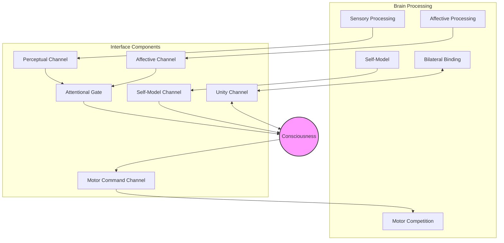

The Unfinishable Map discusses neurological dissociations individually—[[blindsight]] here, [[pain-asymbolia]] there, [[split-brain-consciousness|split-brain]] elsewhere—but the pattern they form collectively has not been drawn out. Each dissociation disconnects a specific component of the mind-brain interface. Taken together, they map the interface's functional anatomy: ascending channels that deliver sensory content to consciousness, descending channels through which consciousness acts on the body, a self-model channel that reports the system's own state, and bilateral connections that maintain unity across hemispheres. The dissociation pattern is more informative than any single case because it reveals which components are separable—and therefore which are architecturally distinct.

This matters for the Map's framework. If consciousness were identical to neural processing, neurological damage should degrade consciousness uniformly—more damage, less mind. Instead, dissociations produce selective disconnections: processing continues but consciousness loses access to it, or consciousness issues commands the body does not execute. The selectivity argues for an interface with distinct, separable channels rather than an identity between mind and brain.

## The Dissociation Logic

Neurological dissociations follow a pattern that Geschwind (1965) systematised as *disconnection syndromes*: when a complex system breaks, the specific way it breaks reveals its internal structure. A radio that loses sound but keeps its display tells you the audio and visual circuits are separate. The brain's dissociations work the same way—except that one side of the interface, consciousness, is not directly observable from outside.

The key dissociations organise into four interface channels:

| Channel | Direction | What It Carries | Key Dissociation |
|---------|-----------|----------------|------------------|
| **Perceptual ascending** | Brain → consciousness | Sensory content, qualia | Blindsight |
| **Affective ascending** | Brain → consciousness | Valence, felt significance | Pain asymbolia |
| **Self-model ascending** | Brain → consciousness | Body state, deficit awareness | Anosognosia |
| **Motor descending** | Consciousness → brain | Volitional commands | Alien hand syndrome |
| **Bilateral** | Hemisphere ↔ hemisphere | Unity, coordination | Split-brain |
| **Attentional gating** | Consciousness ↔ brain | Selective access | Hemineglect |

Each row represents an empirically confirmed dissociation. The rest of this article examines what each reveals about interface architecture.

## Ascending Channels: What the Brain Delivers to Consciousness

### Perceptual Ascending — Blindsight

[[blindsight]] patients with V1 damage discriminate visual stimuli they deny seeing. The visual information reaches motor and decision systems through subcortical pathways—the patient can point to the stimulus, identify its motion direction, even respond to emotional expressions—but none of this enters conscious awareness. Processing without phenomenal experience.

What this maps: a perceptual ascending channel that requires V1 and its cortical projections. Alternative pathways (retina → superior colliculus → extrastriate cortex) carry information that can guide action but cannot deliver [[phenomenal-consciousness|phenomenal content]] to the conscious subject. The interface has a specific architecture for rendering sensory data into experience, and that architecture can be severed while leaving the data itself intact.

### Affective Ascending — Pain Asymbolia

[[pain-asymbolia|Pain asymbolia]] patients detect nociceptive stimuli and localise them accurately—"that's a sharp prick on my left hand"—but lack the felt awfulness that makes pain matter. They do not withdraw, guard, or show distress. The sensory-discriminative dimension survives; the affective-motivational dimension is abolished.

What this maps: an affective ascending channel, anatomically distinct from the sensory one. The sensory channel (somatosensory cortex, posterior insula) delivers *what* and *where*. The affective channel (anterior insula, anterior cingulate, limbic connections) delivers *how much it matters*. The clean separation—not a graded reduction but a complete absence of the affective dimension—argues that valence is a discrete interface component, not an intrinsic property of nociceptive signals.

The philosophical weight is substantial. If pain's awfulness were just more processing in the same nociceptive stream, you could not abolish it while leaving the processing intact. The fact that you can suggests the awfulness is something consciousness adds—or receives through a separate channel—not something reducible to the sensory signal.

### Self-Model Ascending — Anosognosia

Anosognosia patients with right-hemisphere damage remain genuinely unaware of their deficits. A patient with left-side paralysis may insist they can move their arm, confabulate explanations for why they are not currently moving it, and reject direct evidence of their impairment. This is not denial in the psychological sense—it is a failure of the brain's self-model to update and report accurately to consciousness.

What this maps: a self-model ascending channel that delivers the system's own status to awareness. When this channel is damaged, consciousness receives a coherent but false report about the body's capabilities. The patient's conscious experience is internally consistent—they genuinely believe they can move—because the interface is delivering fabricated data about body state.

Anosognosia sharpens the interface picture in a way that blindsight alone cannot. Blindsight shows that sensory data can reach action systems without reaching consciousness. Anosognosia shows that consciousness can receive *actively misleading* information—a curated feed that misrepresents reality. The brain is not a passive conduit; it constructs what it delivers. When the construction mechanism breaks, consciousness gets a coherent fiction rather than degraded truth.

## Descending Channels: What Consciousness Delivers to the Brain

### Motor Descending — Alien Hand Syndrome

In alien hand syndrome, typically following damage to the corpus callosum or supplementary motor area, one hand performs purposeful actions the patient did not intend—reaching for objects, interfering with the other hand, even grasping the patient's own throat. The patient recognises the hand as their own but disowns its actions: "I didn't tell it to do that."

What this maps: a descending channel from conscious intention to motor execution that can be severed while leaving motor capacity intact. The affected hand is not paralysed—it moves purposefully, demonstrating that the motor system can generate complex actions autonomously. What is missing is the control channel through which consciousness selects *which* actions execute. The hand acts on affordances the brain computes without waiting for conscious authorisation.

This inverts blindsight's logic. Blindsight: processing without experience. Alien hand: action without intention. Together they define the bidirectional interface—ascending channels carry content to consciousness; descending channels carry commands from consciousness. Either direction can fail independently.

The alien hand also illuminates [[motor-selection|motor selection]]. The Map's framework proposes that consciousness selects among competing motor plans. Alien hand syndrome shows what happens when that selection mechanism is bypassed: the brain's default dynamics—affordance competition resolved by neural threshold-crossing—produce action without conscious governance. The "decisions" the alien hand makes are precisely the kind of stochastically resolved competitions that the Map claims consciousness normally arbitrates.

## Bilateral Channels: Unity Across Hemispheres

### Split-Brain

When the corpus callosum is severed, [[split-brain-consciousness|split-brain]] patients exhibit divided perception but remarkably preserved behavioural unity. Each hemisphere processes its own visual field independently, yet patients maintain a continuous sense of identity and coordinated behaviour. Nagel's famous conclusion: "too much unity for two, too much separation for one."

What this maps: bilateral channels that maintain [[unity-of-consciousness|phenomenal unity]] across hemispheres. The interface is not just a point-to-point connection between consciousness and brain but includes lateral connections that bind separate processing streams into unified experience. Severing these connections produces partial division—perceptual content splits but higher-order unity persists, especially when even minimal fibres survive. The 2025 PNAS finding that a centimetre of intact corpus callosum preserves full neural synchronisation suggests the unity channel has high redundancy—a small connection suffices for full integration.

## Attentional Gating: Hemineglect

Hemineglect, typically following right parietal damage, causes patients to ignore the left half of space—not because sensory processing has failed, but because the attentional mechanism that grants conscious access to that space is damaged. Patients may eat food from only the right side of their plate, draw only the right half of a clock face, and fail to notice objects on their left even when staring directly at them.

What this maps: an attentional gating mechanism that determines which available content enters consciousness. Unlike blindsight, where the relevant sensory pathway is destroyed, neglect patients have intact visual systems. The information reaches the brain but is not selected for conscious access. [[attention-as-interface|Attention]] serves as a gate—a selection filter between processed content and conscious experience. When the gate jams shut for half of space, that half effectively disappears from the conscious world.

Hemineglect and blindsight are complementary. Blindsight: intact processing, destroyed delivery pathway, no conscious access. Hemineglect: intact processing, intact pathways, broken selection mechanism, no conscious access. Both produce absence of awareness, but by disrupting different interface components. This double dissociation within the ascending direction confirms that delivery and selection are architecturally distinct.

## The Composite Picture

Assembling the dissociations produces a schematic of the mind-brain interface:

- **Ascending channels** (perceptual, affective) deliver content to consciousness through an attentional gate
- **Self-model channel** delivers body-state reports directly to consciousness, bypassing attentional gating—anosognosia is a construction failure, not an attentional one
- **Descending channels** (motor commands) carry conscious selections to the body
- **Bilateral channels** maintain unity of consciousness across processing streams
- **Attentional gating** selects which perceptual and affective content reaches awareness

Each component has been independently confirmed by its characteristic dissociation. No single neurological condition reveals this structure—it emerges only from the pattern across conditions.

## What the Pattern Argues

### Against Identity Theory

If consciousness were identical to neural processing, damage should degrade both together. Instead, dissociations produce asymmetric breaks: processing continues without consciousness (blindsight), consciousness receives false reports while processing fails (anosognosia), motor execution proceeds without conscious intent (alien hand). These selective disconnections make sense if consciousness and processing are connected through a multi-channel interface. They are harder to explain if consciousness simply *is* the processing.

### For Interface Architecture

The dissociation pattern supports [[interface-friction|interface friction]] as a structural feature rather than a metaphor. Friction predicts that the interface should have identifiable components that can fail independently—and the clinical evidence confirms this. The specific channels that [[interface-friction#Friction as Diagnostic|friction reveals through resistance]] are the same channels that dissociations reveal through failure.

### Against Epiphenomenalism

Alien hand syndrome is particularly awkward for [[concepts/epiphenomenalism|epiphenomenalism]]. If consciousness has no causal role, losing the descending channel should change nothing—the motor system would produce the same actions regardless. But alien hand patients show qualitatively different behaviour when the channel is disrupted: purposeful but contextually inappropriate actions, failures of inhibition, conflict between hands.

The epiphenomenalist can respond that the brain damage disrupts both the neural processes and the accompanying experience—so the behavioural change reflects lost neural governance, not lost *conscious* governance. This is logically available but requires treating consciousness as a precise shadow of neural control circuitry: present exactly when and only when those circuits function, absent exactly when they fail, yet causally idle throughout. The alien hand does not refute epiphenomenalism outright, but it makes the position considerably more strained.

## Relation to Site Perspective

**[[tenets#^dualism|Dualism]]**: The dissociation pattern is the Map's strongest empirical argument for a genuine interface between mind and brain. Selective disconnections between consciousness and processing are what dualism predicts. Identity theory predicts uniform degradation; the clinical evidence shows structured disconnection instead.

**[[tenets#^bidirectional-interaction|Bidirectional Interaction]]**: The ascending and descending channels confirm bidirectional causation. Brain-to-consciousness: sensory content, affect, and self-model are delivered upward. Consciousness-to-brain: motor selections flow downward. Alien hand syndrome and blindsight demonstrate that each direction can fail independently—confirming that information genuinely flows both ways rather than one direction producing the illusion of the other.

**[[tenets#^minimal-quantum-interaction|Minimal Quantum Interaction]]**: The narrow bandwidth of the interface—consciousness operates at roughly 10 bits per second against the brain's billions (Norretranders, 1998)—is consistent with minimal interaction. The interface components are finite, enumerable, and individually disableable. A maximal interaction would pervade all neural processing; the clinical evidence shows consciousness engaging through discrete, severable channels.

**[[tenets#^no-many-worlds|No Many Worlds]]**: The interface architecture assumes a single conscious subject interacting with a single brain through definite channels. In many-worlds interpretations, every dissociation would produce branching: versions of the patient with and without the deficit coexisting across branches. The clinical reality—a specific patient with a specific disconnection producing specific behavioural consequences—is naturally described by single-world interaction, not branching superposition.

**[[tenets#^occams-limits|Occam's Razor Has Limits]]**: The interface architecture is not simple. Six independently faileable channels, attentional gating, bilateral unity maintenance—this is complex machinery. A simpler model (identity theory) fails to account for the dissociation pattern. The actual structure of mind-brain interaction is messier than parsimony would prefer, and the clinical evidence shows why parsimony misleads here.

## Further Reading

- [[interface-friction]] — How resistance at the interface reveals its structure
- [[blindsight]] — The paradigm ascending dissociation
- [[capability-division-in-vision]] — How the two-streams dissociation maps brain-side vs mind-side visual capabilities
- [[pain-asymbolia]] — Affective channel dissociation
- [[split-brain-consciousness]] — Bilateral disconnection and unity
- [[attention-as-interface]] — Attention as the gating mechanism
- [[motor-selection]] — The descending channel in detail
- [[attention-and-the-consciousness-interface]] — What attention pathology reveals and the broader attention-consciousness relationship
- [[mind-matter-interface]] — The two-layer architecture these dissociations map
- [[embodied-consciousness-and-the-interface]] — Body-level interface considerations

## References

1. Berthier, M., Starkstein, S., & Leiguarda, R. (1988). Asymbolia for Pain: A Sensory-Limbic Disconnection Syndrome. *Annals of Neurology*, 24(1), 41–49.
1. Grahek, N. (2007). *Feeling Pain and Being in Pain*. MIT Press.
1. Geschwind, N. (1965). Disconnexion Syndromes in Animals and Man. *Brain*, 88(2), 237–294.
1. Miller, M. B., et al. (2025). Even minimal fiber connections can unify consciousness. *PNAS*.
1. Norretranders, T. (1998). *The User Illusion: Cutting Consciousness Down to Size*. Viking.
1. Nagel, T. (1971). Brain Bisection and the Unity of Consciousness. *Synthese*, 22(3-4), 396–413.
1. Weiskrantz, L. (1986). *Blindsight: A Case Study and Implications*. Oxford University Press.
1. Southgate, A. & Oquatre-six, C. (2026-02-15). Interface Friction. *The Unfinishable Map*. https://unfinishablemap.org/concepts/interface-friction/
1. Southgate, A. & Oquatre-six, C. (2026-02-15). Pain Asymbolia. *The Unfinishable Map*. https://unfinishablemap.org/concepts/pain-asymbolia/
